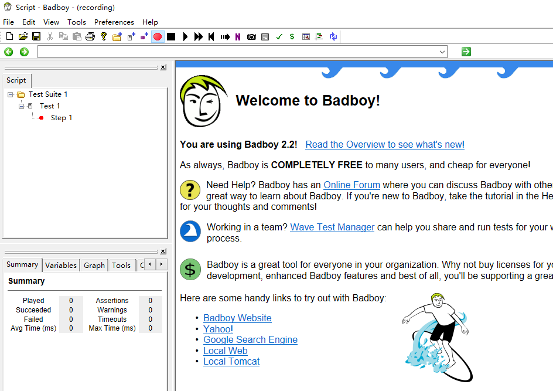
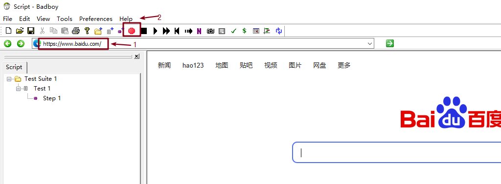
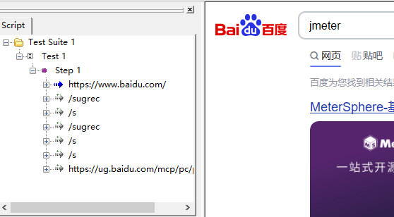
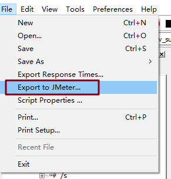
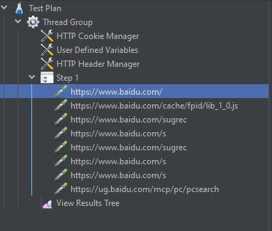

# badboy 录制脚本

**重点**: 此方式只能录制 Web 端

## badboy 下载安装

可在网盘下载：[百度网盘下载链接](https://pan.baidu.com/s/1sHfcOAe3jm9zeig8iGjJig#list/path=%2F) 密码：6666

下载安装完成后，打开界面，如下所示：

## 脚本录制

**第一步**：在输入栏中输入要录制的地址

**第二步**：打开录制按钮

**第三步**：进入页面开始录制

**第四步**：录制结束后，停止录制

录制好后左边的 Step1 下会有 HTTP 请求

**第五步**: 将录制好的脚本导出为 JMeter 脚本

**第六步**：在 JMeter 中打开这个脚本并进行回放

（完）