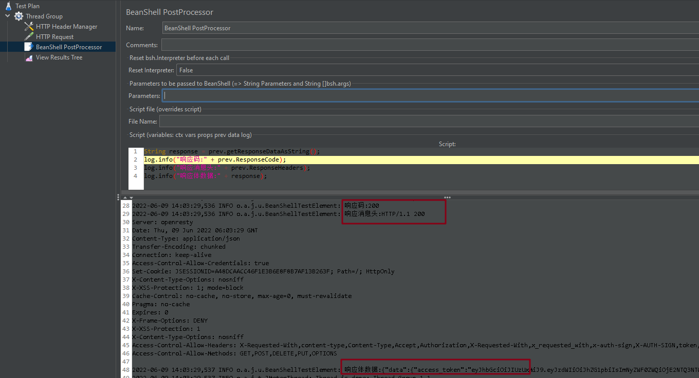
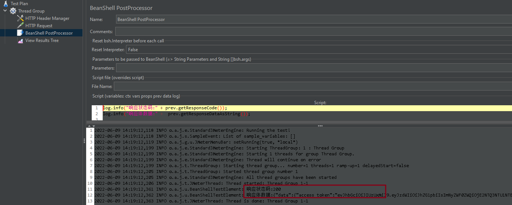
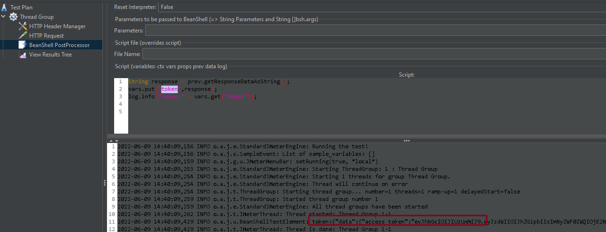
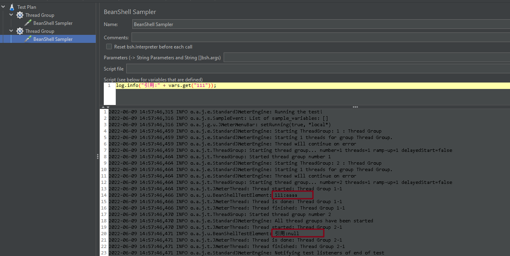
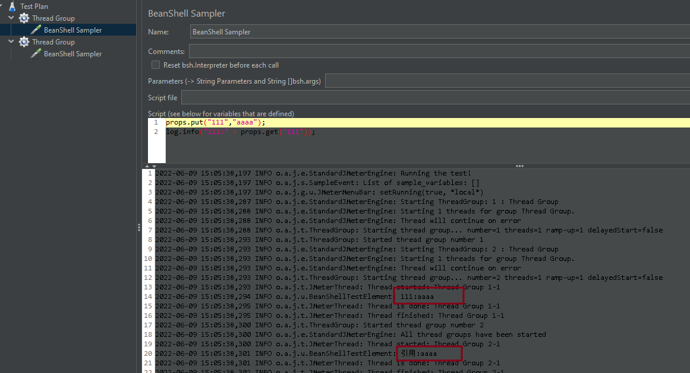
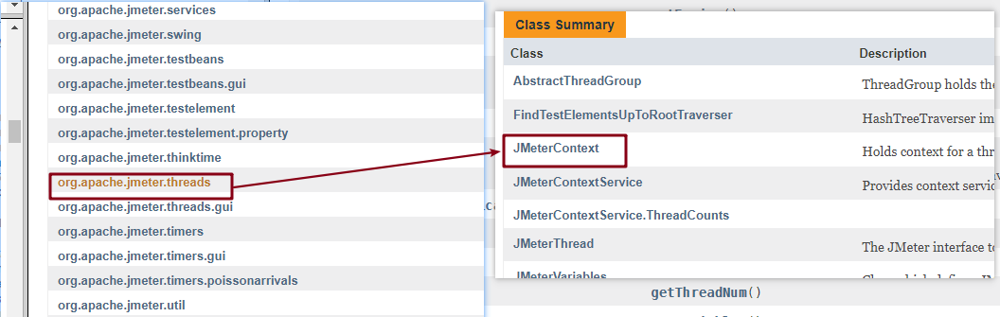

# BeanShell

## 什么是 BeanShell

+ BeanShell 是一种类似 JAVA 的脚本语言

+ 通过 BeanShell 可以对请求数据、响应数据或环境变量进行更加灵活的处理和判断
+ 还可以直接调用外部的 JAR 包，例如：可以直接引入现成的第三方 JSON 解析包来使用 

**Jmeter 中 BeanShell**：

+ 定时器：BeanShell Timer

+ 前置处理器：BeanShell PreProcessor

+ 采样器：BeanShell Sampler

+ 后置处理器：BeanShell PostProcessor

+ 断言：BeanShell Assert

+ 监听器：BeanShell Listener 

## BeanShell的内置变量和方法 

BeanShell 有一些默认的内置变量和方法，用户可以通过这些变量与 JMeter 进行交互

### log

**作用**：输出信息到日志

**用法**：

```java
log.debu(“调试信息”)

log.info(“响应状态码” + prev.ResponseCode)
    
log.warn(“警告信息”)

log.error(“出错信息”) 
```

示例：



### prev

**作用**：获取当前请求结果

**用法**：

```java
prev.getResponseDataAsString()：获取响应体数据（String 类型)

prev.getResponseCode()：获取状态码（同 ResponseCode，String 类型）
```

示例：



### vars

**作用**：操作 JMeter 的变量

**用法**：

```java
vars.get(“变量名”)：获取变量的值（假设为 String 类型）

vars.put(“变量名”, 变量值)：设置变量值
```
示例：



::: warning 注意

+ vars 设置的变量类似于局部变量

+ vars 不可以跨线程获取变量

:::



### props

**作用**：操作 JMeter 变量，类似 vars

**用法**：

```java
props.get(“变量名”)：获取变量的值（假设为 String 类型）

props.put(“变量名”, 变量值)：设置变量值
```

::: warning 注意

+ props 设置的变量类似于全局变量

+ props 可以跨线程获取变量

:::



### ctx

**作用**：获取当前线程上下文数据（可获取所有信息）

**用法**：

```java
ctx.getVariables(“变量名”)：获取变量值（同 vars.get())

ctx.setVariables(“变量名”, “变量值”)：设置变量（同 vars.put())

ctx.getProperties(“属性名”)：获取属性值（同 props.get()）

ctx.setProperties(“属性名”,“属性值”)：设置属性（同 props.put()）

ctx.getPreviousResult()：获取当前请求结果同（prev）

ctx.getCurrentSampler()：获取当前采样器

ctx.getPreviousSampler()：获取前一采样器

ctx.getThreadNum()：获取线程数

ctx.getThreadGroup()：获取线程组

ctx.getThread()：获取当前线程

ctx.getEngine()：获取引擎

ctx.isSamplingStarted()：判断采样器是否启动

ctx.isRecording()：判断是否开启录制

ctx.getSamplerContext()：获取采样器上下文数据 
```

可参考 JMeter 的 API 文档




（完）