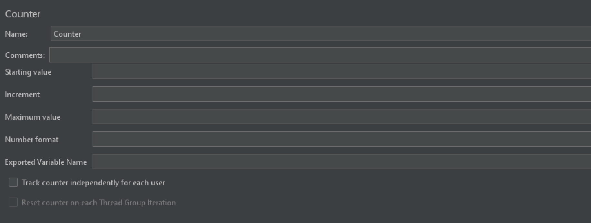
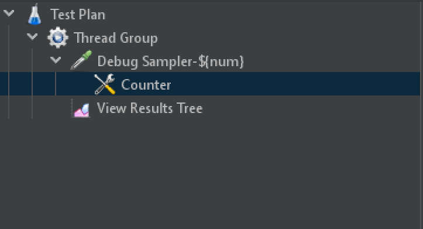
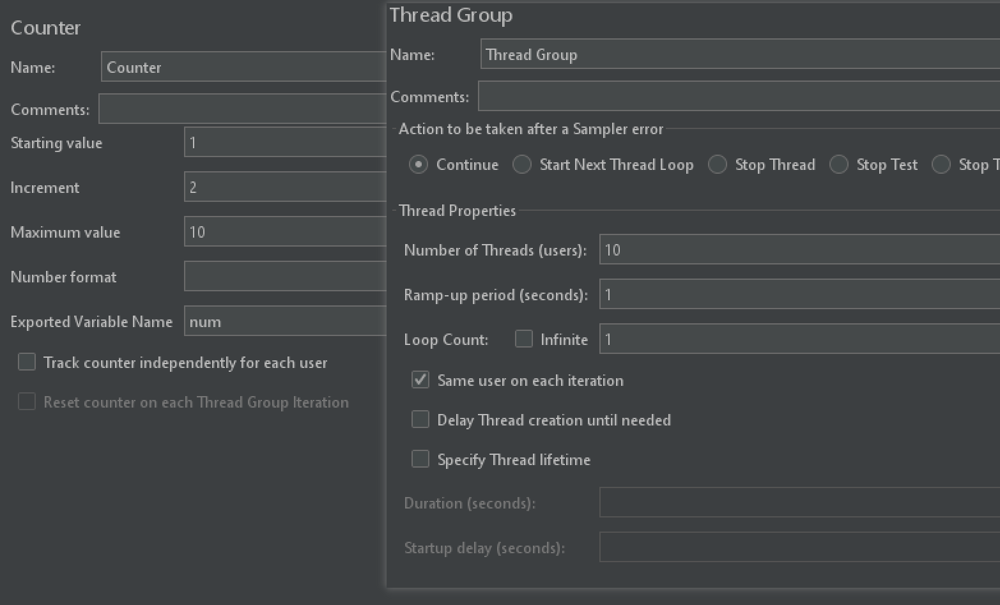
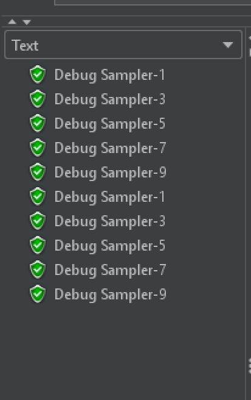
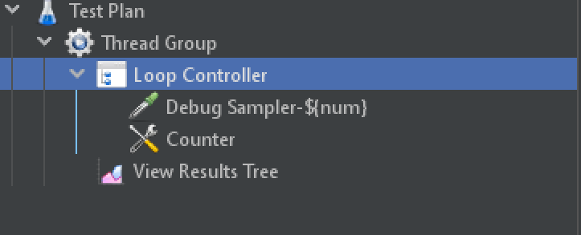
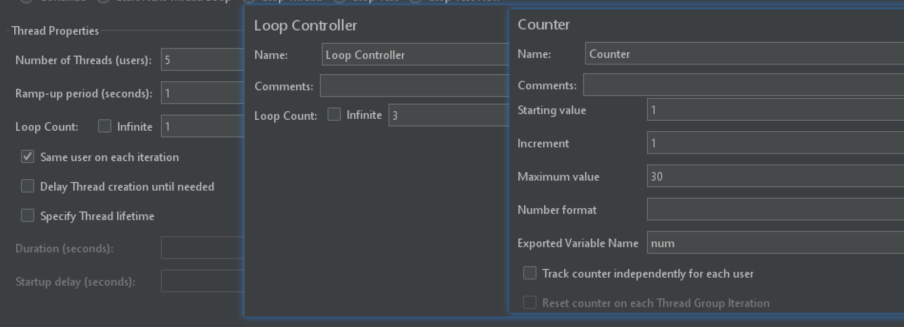
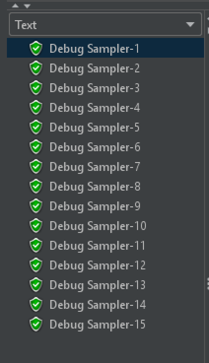
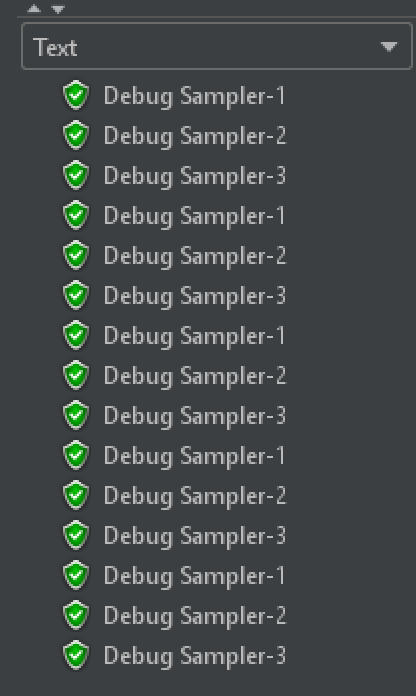

# Counter 计数器

## 简介

位置：配置元件中

作用：循环递增生成数字

取值范围：计数器使用 long 来存储值，因此取值范围是 `-2 ^ 63 到 `2 ^ 63-1 `

可在测试计划任一位置添加

## 界面介绍

字段介绍：

| 字段                                         | 说明                                 |
| -------------------------------------------- | ------------------------------------ |
| Starting value                               | 初始值，long 整型，默认 0            |
| Increment                                    | 每次迭代的递增值，默认 0，表示不增加 |
| Maximum value                                | 最大值，包含此值                     |
| Number format                                | 数字可选格式                         |
| Exported Variable Name                       | 引用名称                             |
| Track counter independently for rach user    | 每个用户都有一个独立的计数器         |
| Reset counter on each Thread Group Iteration | 每次线程组迭代时计数器将重置为初始值 |

## Counter 实例

### 基础例子

测试计划结构树

线程组和 Counter 配置：

运行结果：

由于设置的 Increment 为 2 ，所以计数器只能计数 5 次，但线程数有 10 个，所以会重新计数

### Counter + Loop Controller

测试计划结构树：

线程组、Counter、Loop Controller 配置：

运行结果：

**未勾选 Track counter independently for rach user**：

以上结果可以看出：

- 因为有 5 个线程，每个线程循环 3 次，一共 15 个请求，所以计数器是循环了 15 次
- 此时计数器是对**所有线程共享**的，属于线程组全局计数器，所以计数器是累计循环了 15 次

**勾选 Track counter independently for rach user**：

以上结果可以看出：

- 每个线程运行时，计数器都是从初始值算起的
- 此时计数器是**每个线程独享**的，不再是公共计数器，所以每次有**新的线程运行**时，都是新的计数器开始循环计数
- 计数器的计数与控制器的循环次数有关

**注意**：使用计数器生成的变量，值的类型为 string，所以有比较之类的操作时，需要带 "" 操作

（完）