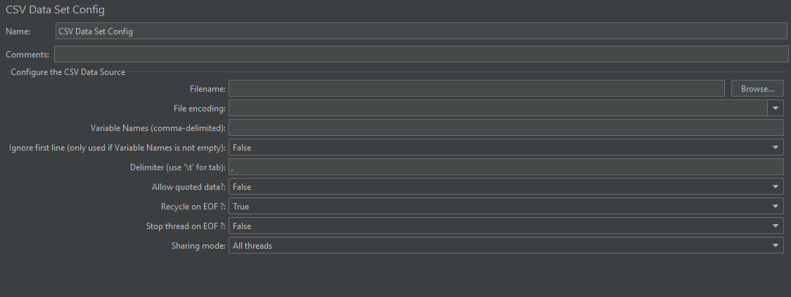
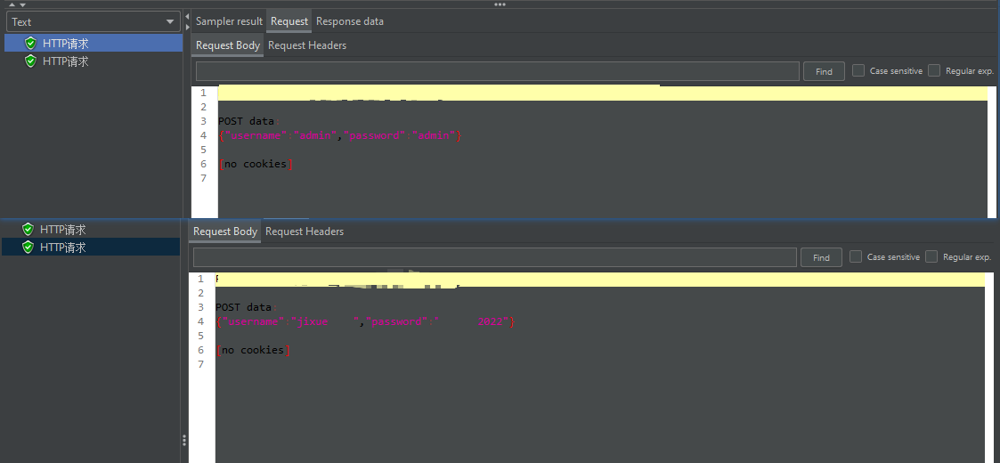
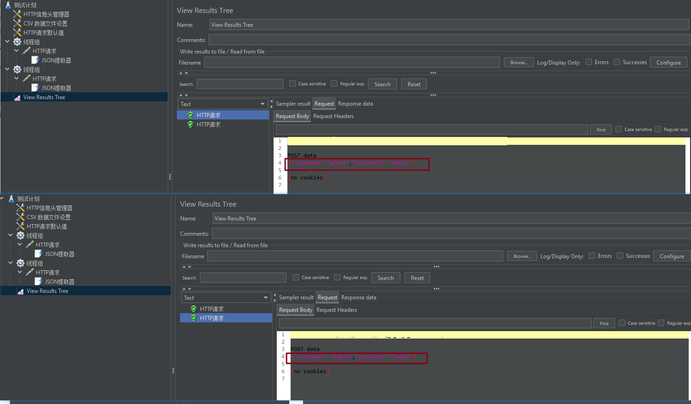
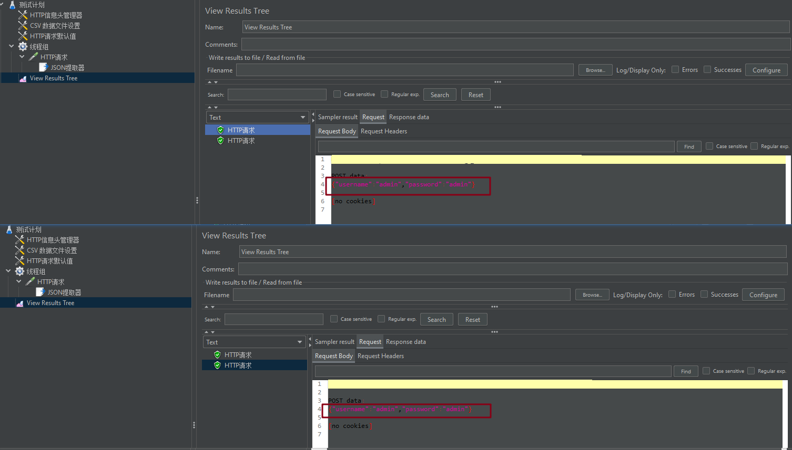

# CSV Data Set config

作用：使用 CSV Data Set config 进行参数化设置

**适用于大量测试数据时的使用**

## 界面

右击 add--Sample--Config Element--CSV Data Set config 进行添加

## CSV Data Set Config 各个参数说明：

### **Filename**

csv 文件所在的路径以及名称

**注意**：不一定要 .csv 文件，亲测 .txt 格式的文件也可以的

### **File encoding**

页面的编码方式，可以不填写

### **Variable Names(comma-delimited)**

变量名，可以在后面被引用

### **Delimiter(use '\t' for Tab)**

用来隔开变量的分隔符

### **Allow quoted data?**

是否允许引用数据

目前设置成 True 或者 False 都能正常引用数据

### **Recycle on EOF?**

到了文件尾是否循环

True：继续从文件第一行开始读取

False：不再循环

### **Stop thread on EOF?**

到了文件尾是否停止线程

True：停止

False：不停止

**注意**：当 Recycle on EOF 设置为 True 时，此项设置无效

### **Sharing mode**

共享模式

#### **All threads**：

+ 测试计划中所有线程
+ 假如说有线程1 到线程 n (n>1)，线程1 取了一次值后，线程2 取值时，取到的是 csv 文件中的下一行，即与线程1 取的不是同一行

例子：设置 1 个线程组，设置 2 个线程数，选择该模式，可以查看取的数据不一致

#### **Current thread group**：

+ 当前线程组
+ 假设有线程组A、线程组B，A组内有线程A1 到线程An，线程组B 内有线程B1 到线程Bn。取之情况是：线程A1 取到了第 1 行，线程A2 取第 2 行，现在B1 取第 1 行，线程B2 取第 2 行

例子：设置 2 个线程组，每个线程组设置 1 个线程数，选择该模式，可以查看取的数据一致

#### **Current thread**：

+ 当前线程
+ 假设测试计划内有线程1 到线程n (n>1)，则线程1 取了第 1 行，线程2 也取第 1 行使用

例子：设置 1 个线程组，设置 2 个线程数，选择该模式，可以查看取的数据一致

**总结**：

+ 要使用 CSV 文件中的所有参数，在线程组中就必须设置线程数或循环次数

（完）