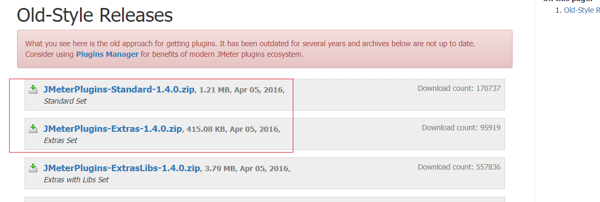
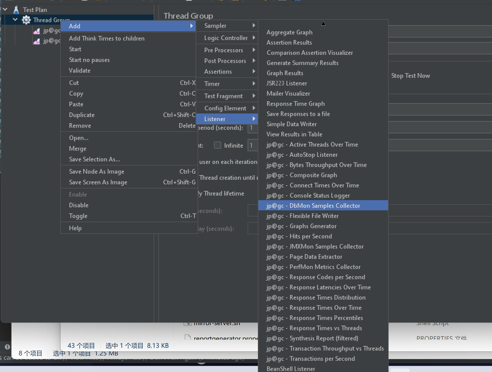

# 安装监听器插件

## 监听器插件下载

> 官网地址：https://jmeter-plugins.org/downloads/old/

下载 JMeterPlugins-Standard 和 JMeterPlugins-Extras 包

下载完成后，将其进行解压

## 放置监听器插件

找到上面下载并解压的文件夹中的 `lib->ext->JMeterPlugins-Standard.jar`、`JMeterPlugins-Extras.jar`

将这两个文件复制到 JMeter 文件夹的` lib->ext` 文件下

## 重启 JMeter 生效插件配置

上述操作完成后，重新打开 JMeter 监听器，可以发现监听器中出现 jp@gc 等表示监听器插件添加成功

（完）