# ForEach 控制器

位置：逻辑控制器中

## 什么是 ForEach 控制器

用来遍历取出变量的一种控制器

+ ForEach 控制器一般和用户自定义变量或 JDBC 结果变量一起使用，用于可以遍历读取相关的返回值
+ 该控制器下的 Samplers 和控制器都会被执行一次或多次，每次读取不同的变量值
+ ForEach 控制器可以省略正则提取器提取出来的变量值用 `_` 分隔的 `_`

## 界面介绍

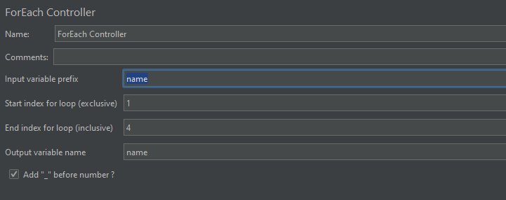

字段介绍：

| 字段                            | 说明                                                         |
| ------------------------------- | ------------------------------------------------------------ |
| Input Variable Prefix           | 输入变量名的前缀，默认为一个空字符串作为前缀                 |
| Start index for loop(exclusive) | 循环开始的索引 不包括此值 默认从 1 开始            |
| End index for loop(inclusive)   | 循环结束的索引 包括此值                                 |
| Output variable                 | 输出的变量名 后面的 sampler 可使用该变量名              |
| Add”_”before number             | 输入的变量名和索引之间是否有 `_` 间隔 不勾选的话，则变量名和索引直接相连 默认勾选 |

## ForEach 控制器实例

### ForEach + 用户自定义变量

测试计划结构树：

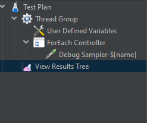

用户自定义变量：

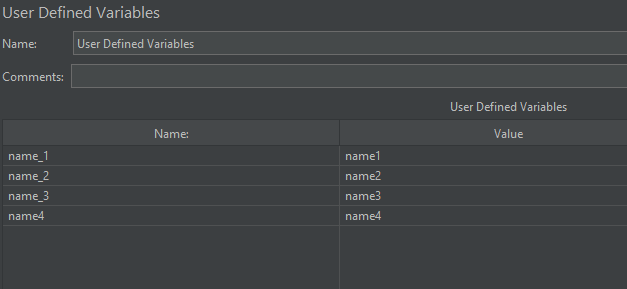

ForEach 勾选 Add”_”before number  ：

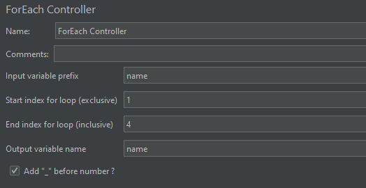

测试结果：

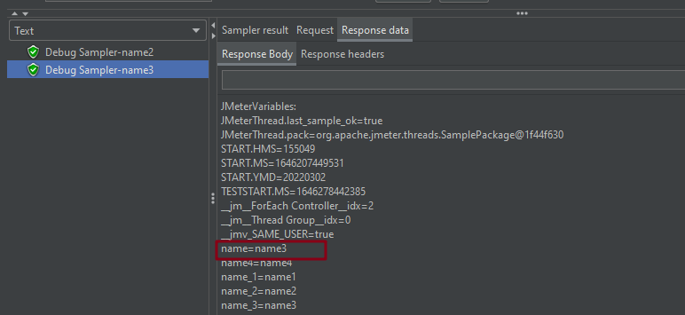

上面结果可以看出：

+ Start index for loop(exclusive) 填 1 ，则从第二个变量开始取值
+ 勾选 Add”_”before number 后没有取 第 4 个值

#### 无输出变量名

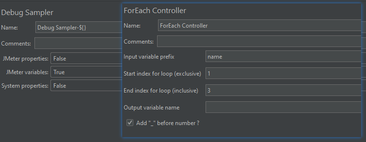

测试结果：

**重点**：无输出变量名时，可使用 `${}` 获取变量

### ForEach + JDBC Request

#### 使用 Variable Names 接收 JDBC 返回的数据

测试计划结构树 + JDBC Request：

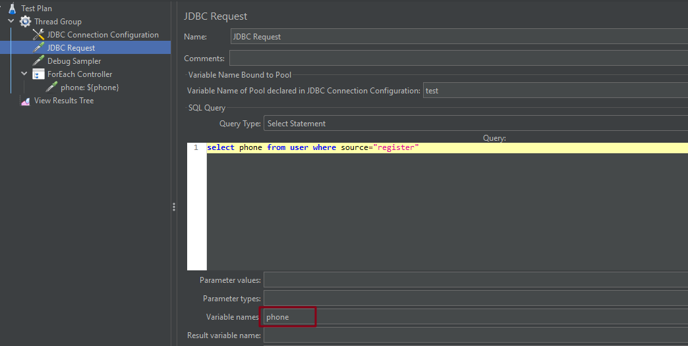

JDBC 返回的结果：

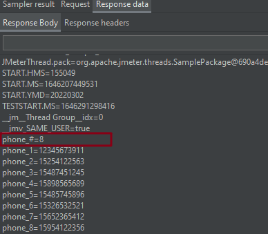

ForEach:

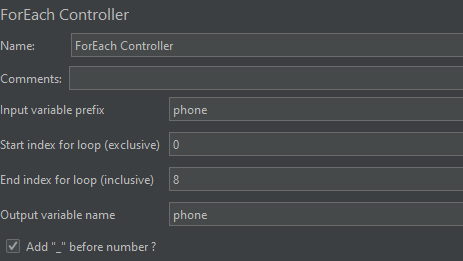

测试结果：

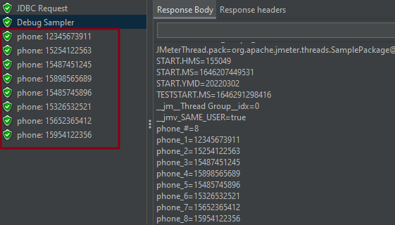

#### 使用 Result variable name 接收 JDBC 返回的数据

测试计划结构树 + JDBC Request：

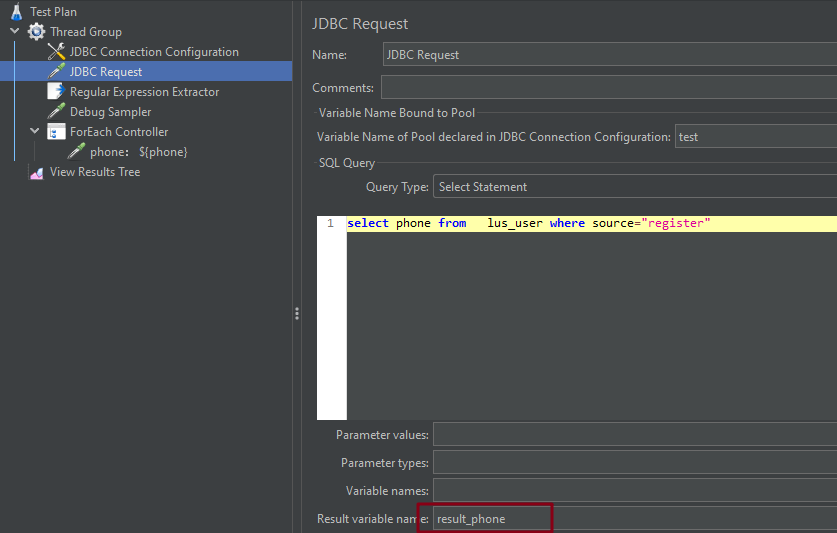

JDBC 返回的结果：

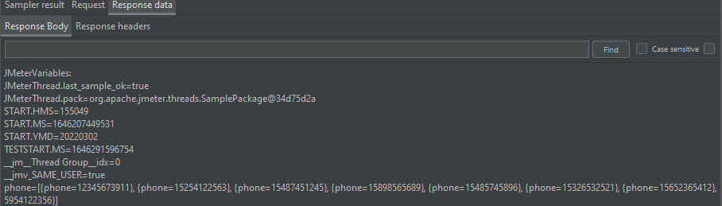

- 这里通过 Result Variable name 去接收所有数据，只有一个变量，是无法循环的
- 所以我们需要通过**正则提取器**将需要的 phone 字段的值提取出来

正则提取器：

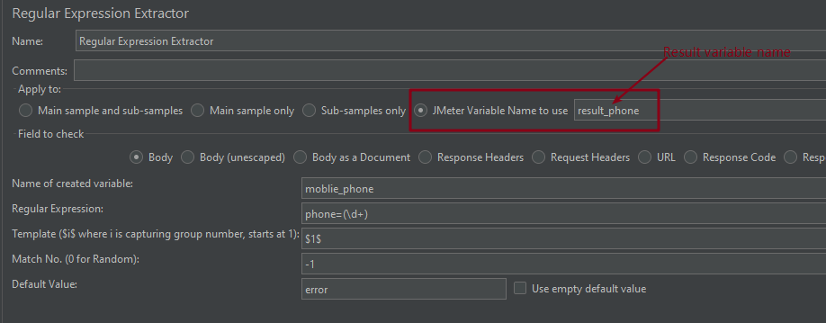

正则表达式提取的结果：

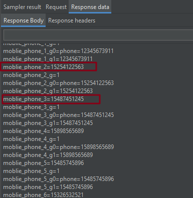

ForEach:

但是正则会提取不必要的字段值（如：mobile_phone_1_g0），所以注意 ForEach 的输入变量前缀要写正确

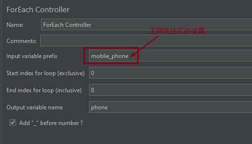

测试结果：

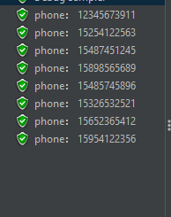

（完）