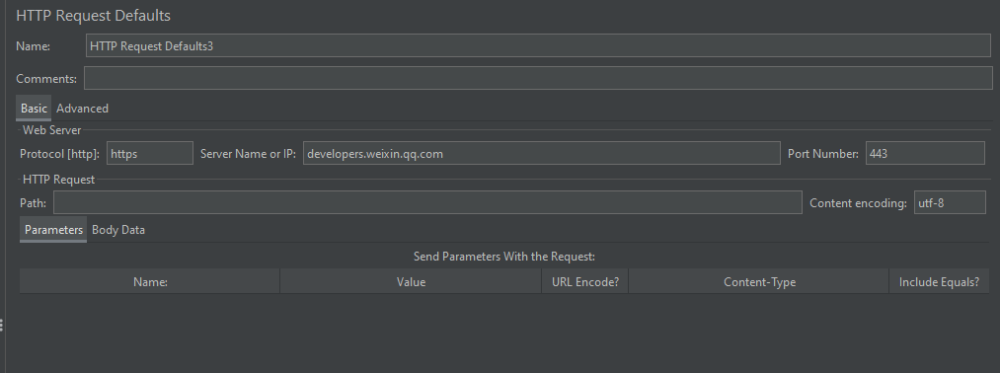

# HTTP 请求默认值

## 界面介绍

界面与 HTTP Resquest 类似，就不重复介绍字段值意思啦

HTTP 请求默认值，可以添加在测试计划、线程组、HTTP 请求下

**思考**：既然测试计划、线程组、HTTP 请求下都可以添加，那优先级顺序是什么样子的呢？

## 请求默认值优先级

先看个例子：

创建一个测试计划，下面创建 2 个线程组，每个线程组下创建 2 个 HTTP 请求，测试计划、线程组、HTTP 请求下分别创建一个 HTTP 请求默认值，如图：

配置如下：

**测试计划下的 HTTP 请求默认值配置(后面简称 1)**：

**线程组1 下的 HTTP 请求默认值配置(后面简称 2)**:

**HTTP1 下的 HTTP 请求默认值配置(后面简称 3)**:

**HTTP2 配置了个参数**:

其他 HTTP 请求暂无其他配置

**运行查看结果**：

HTTP1：

+ 使用了 3 请求默认值中的协议、端口、编码
+ 请求了 3 请求默认值中的 url，覆盖了其他 1 和 2 的请求默认值中的 url
+ 参数拼接了 1 和 2 请求默认值中设置的参数

HTTP2：

+ 使用了 2 请求默认值中的协议、端口和 1 请求默认值中的编码
+ 请求了 1 请求默认值中的 url
+ 参数拼接了 1 和 2 请求默认值中和本身 HTTP 请求中设置的参数

HTTP3、HTTP4：

所在线程组由于没有设置额外的请求默认值，本身请求也没有设置，所以请求的是 1 请求默认值中的 URL，使用的也是 1 中设置的协议、端口和编码、参数

**总结**：

+ 测试计划、线程组、HTTP 请求均可添加请求默认值
+ 测试计划下请求默认值的作用域是**所有线程组中的 HTTP 请求**
+ 线程组下的请求默认值的作用域是**该线程组下的所有 HTTP 请求**
+ HTTP 请求下的请求默认值的作用域是**该 HTTP 请求**
+ 优先顺序：HTTP 本身请求 > HTTP 请求下的默认值 > 线程组下的请求默认值 > 测试计划下的请求默认值
+ 参数不会按照上述的优先顺序，所有请求默认值中的参数或请求体会被拼接(Json 格式的请求体不会被合并)

（完）