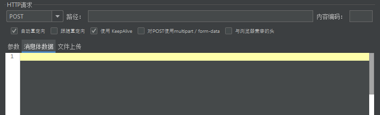

# HTTP 请求

**前提**：想要更好的掌握 HTTP 请求的配置，需要先了解什么是 HTTP 请求，可以参考：[HTTP协议](/basic-skills/network/HTTP协议)

线程组右击选择添加-->取样器-->HTTP请求，界面如下：

## 基本配置

字段介绍：

| 字段名                          | 作用                                                         |
| ------------------------------- | ------------------------------------------------------------ |
| 名称                            | 建议自定义一个识别度高的名称                                 |
| 注释                            | 对于测试没有任何影响，仅记录作用                             |
| 协议                            | http 或 https，默认：http 不区分大小写                       |
| 服务器名称或IP                  | 服务器域名或者 ip，**不包括协议**，如：www.baidu.com、192.168.196.128 |
| 端口号                          | 目标服务器的端口号，**默认：**80                             |
| 方法                            | 发送 HTTP 请求的方法                                         |
| 路径                            | 目标请求的 URL 路径不包括**协议、host、ip、端口**            |
| 内容编码                        | 请求的编码方式，**默认：**iso8859                            |
| 自动重定向                      | 发出的请求的响应码是 **3xx**，会自动跳转到新目标页面只记录最终页面的返回结果 |
| 跟随重定向                      | 和自动重定向**唯一不同**的是：会记录重定向过程中的的**所有请求**的响应结果 |
| 使用 KeepAlive                  | JMeter 和目标服务器之间使用 Keep-Alive 方式进行 HTTP 通信真正做性能测试强烈建议不勾选 |
| 对 POST 使用multipart/form-data | POST 请求需要上传文件时勾选                                  |
| 与浏览器兼容的头                | 当勾选 multipart/form-data 时，勾选此项 HTTP 请求头中的 Content-Type 和 Content-Transfer-Encoding 被忽略而只发送 Content-Disposition 部分 |

### 请求参数

字段介绍：

| 字段      | 描述                                                         |
| --------- | ------------------------------------------------------------ |
| 名称      | 参数名                                                       |
| 值        | 参数值                                                       |
| URL 编码? | 是否要 URL 编码？如果参数值包含了中文、特殊字符（非数字字母以外），最好勾上，当然全都勾上最稳妥 |
| 内容类型  | 参数值的资源类型**默认：**text/plain                         |
| 包含等于? | 当你的参数值**为空**的时候，可以选择不包含=，默认勾选如果参数值**不为空**，则不可以取消勾选 |

栗子：百度搜索

请求参数：

**注意**：

+  最终表单的参数列表会拼接到 URL 中，所以如果包含了中文、特殊字符就要勾选**编码？** 
+ 使用 GET 请求方式的不能使用消息体数据传参，会无法识别参数

### 消息体数据

+ 传入 Json 格式的数据，JMeter 不能识别为 Json，必须添加请求头 content-type: application/json 
+ 参数列表中有参数时，是不能切换到消息体数据的，必须先删除

栗子：用户登录

**注意**：

+ 勾选选项【对 POST 使用 multipart/form-data】时，选择 GET  请求时，参数会不生效
+ 添加了请求头时，不要再勾选上述选项，会导致所有的请求参数被**当成文件以二进制传输**，不会被识别，接口会提示参数为空

