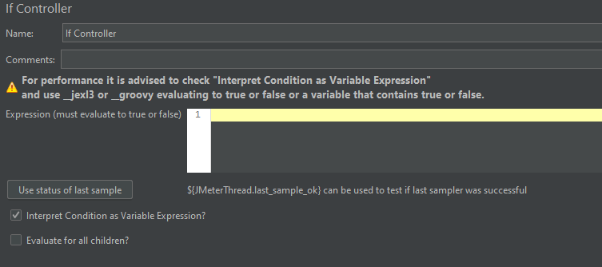

# If 控制器

作用：通过条件来判断是否执行其下的元件

## 界面介绍

字段说明：

- **Expression (must evaluate to true or false) ：**表达式（值必须是 true 或 false )，也就是说，在右边文本框中输入的条件值必须是 true 或 false（默认情况下）
- **Interpret Condition as Variable Expression?：**默认勾选，将条件解释为变量表达式（有信息提示需要使用` ${____jexl3 } `或 `${__groovy }` 表达式）
- **Evaluate for all children?：**条件作用于每个子项

## If 控制器实例

### Expression 使用非变量

测试计划结构树：

#### 控制器 1：

不勾选 Interpret Condition as Variable Expression 

#### 控制器 2：

勾选 Interpret Condition as Variable Expression 使用 `__jexl3`

#### 控制器 3：

勾选 Interpret Condition as Variable Expression 使用 `__groovy`

测试结果：

###  Expression 使用变量

**注意**：使用变量时，必须勾选 Interpret Condition as Variable Expression

测试计划结构树 + 用户自定义变量：

If 控制器 + 测试结果：

### Evaluate for all children

测试计划结构树 + 用户自定义变量：

If 控制器：

后置脚本处理器：

测试结果：

**总结**：

勾选了 Evaluate for all children? 意味着它的每个子元素在运行前都会运行一次 if 控制器里面的条件表达式，看看是否还是 true，是的话就可以运行，false 就不运行

（完）