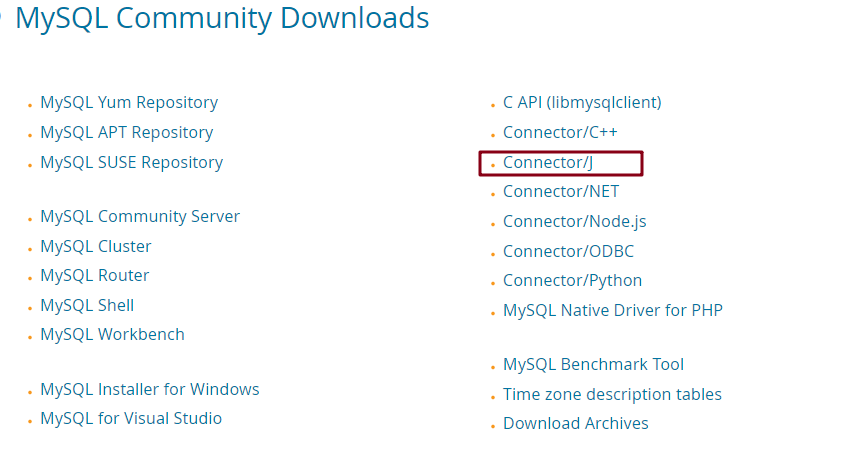
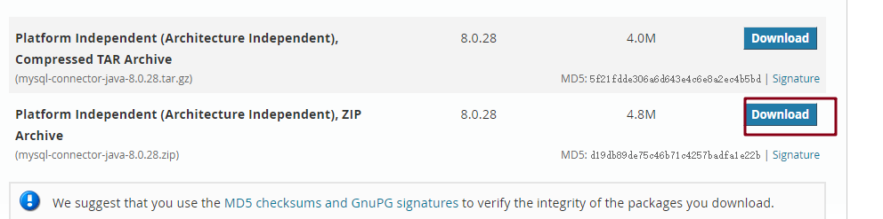

# JDBC  连接配置

## 前提条件

+ 本文所述为连接 Mysql
+ 需要先下载连接 Mysql 的 jar 包

**jar 包下载**：

下载链接：https://dev.mysql.com/downloads/



选择 Connect/J ，选择下图框出来的


选择 ZIP 文件下载



下载完成后，将解压出的 jar 包文件放在 lib/ext 目录下

## JDBC 连接配置

位置：配置元件中 JDBC Connection Configuration

在配置 JDBC Connection Configuration 前需要在测试计划中引入连接的 jar 包

**方式一**：

将上述下载好的 jar 包放入 JMeter 文件下的 lib/ext 目录下，JMeter 启动时，可以自动加载

**方式二**：

在测试计划底部引入 jar 包


## 配置介绍


参数介绍：

**Variable Name Bound to Pool 部分**：

Variable Name for created Pool：变量名绑定到池，与 JDBC 取样器中对应

**Connection Pool Configuration 部分**：

此部分一般用默认值

| 参数                                      | 说明                                                         |
| ----------------------------------------- | ------------------------------------------------------------ |
| Max Number of Connections                 | 最大连接数，性能测试时，建议填 0                             |
| Max Wait(ms)                              | 在连接池中取回连接最大等待时间                               |
| Time Between Eviction Runs(ms)            | 线程可空闲时间<br />如果使用当前连接池中某个连接在空闲 Time Between Eviction Runs Millis 时间后仍然没有使用，则被物理性的关闭掉 |
| Auto Commit                               | 自动提交 SQL 语句                                            |
| Transation Isolation                      | 事务隔离级别                                                 |
| Preinit Pool                              | 立即初始化连接池<br />如果为 False 则第一个 JDBC 的请求的响应时间会比较长，因为包含了连接池建立的时间 |
| Init SQL statements separated by new line | 初始化语句，在连接成功后执行                                 |

**Connection Validation by Pool  部分**：

 验证连接池是否可响应 

| 参数                             | 说明                                                         |
| -------------------------------- | ------------------------------------------------------------ |
| Test While Idle                  | 当连接空闲时是否断开                                         |
| Soft Min Evictable Idle Time(ms) | 连接在池中处于空闲状态的最短时间                             |
| Validation Query                 | 一个简单的查询，确定数据库是否仍在响应<br />默认为 JDBC 驱动程序的 isValid() 方法，适用于许多数据库 |

**Database Connection Configuration 部分**：

数据库连接配置

| 参数                  | 说明                                           |
| --------------------- | ---------------------------------------------- |
| Database URL          | 数据库连接 URL                                 |
| JDBC Driver class     | 数据库驱动，可根据数据库类型下拉选择相应的驱动 |
| Username              | 数据库登录用户名                               |
| Password              | 数据库登录密码                                 |
| Connection Properties | 建立连接时要设置的连接属性                     |

Database URL 举例

```
jdbc:mysql://localhost:3306/dbname?useUnicode=true&characterEncoding=UTF8&autoReconnect=true&allowMultiQueries=true（允许执行多条 sql）
```

 常见数据库的连接 URL和驱动

| 数据库     | 驱动                                         | URL                                                  |
| ---------- | -------------------------------------------- | ---------------------------------------------------- |
| MySQL      | com.mysql.jdbc.Driver                        | jdbc:mysql://host:port/{dbname}                      |
| PostgreSQL | org.postgresql.Driver                        | jdbc:postgresql:{dbname}                             |
| Oracle     | oracle.jdbc.driver.OracleDriver              | jdbc:oracle:thin:user/pass@//host:port/service       |
| sqlServer  | com.microsoft.sqlserver.jdbc.SQLServerDriver | jdbc:sqlserver://host:port;databaseName=databaseName |

（完）