# JDBC Request

## 前提

+ 需要了解 SQL 语句
+ JDBC Request 主要是向数据库发送请求，获取返回的数据集
+ 需要和 JDBC  Connection Configuration 一起使用，具体配置可参考 [JDBC 连接配置](test/tools/Jmeter/JDBC连接配置)
+ 位置：取样器中

## 界面介绍

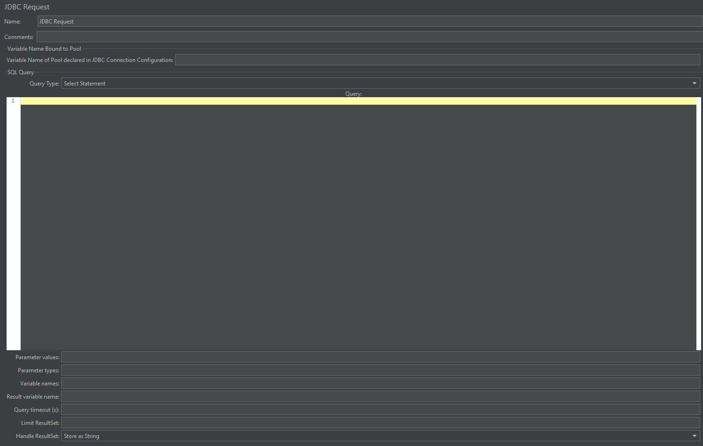

参数字段：

**Variable Name Bound to Pool 部分**：

Variable Name of Pool declared in JDBC Connection Configuration：数据库连接池配置的名称，与 JDBC Connection Configuration 中一致

**SQL Query 部分**：

| 参数                 | 说明                                                         |
| -------------------- | ------------------------------------------------------------ |
| Query Type           | SQL 语句的类型                                               |
| SQL Query            | SQL 语句 语句结尾不需要添加 `;` 变量用 `?` 占位    |
| Parameter values     | 需要传递的变量值，多个变量用 `,` 分隔                        |
| Parameter types      | 变量类型                                                     |
| Variable Names       | 保存 SQL 语句返回的数据和返回数据的总行数 用 `,` 分隔   |
| Result Variable Name | 一个 Object 变量存储所有返回值                               |
| Query timeout(s)     | 超时时间；默认0，代表无限时间                                |
| Limit ResultSet      | 和 limit 类似作用，限制 sql 语句返回结果集的行数             |
| Handle ResultSet     | 如何定义 callable statements 返回的结果集；默认是存储为字符串 |

## 实例

### 纯 SQL 的例子

JDBC  Request

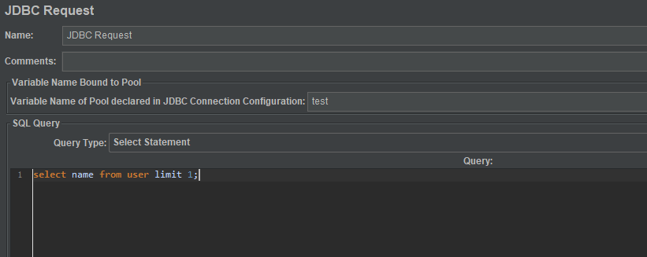

输入的是 SQL 语句，不同类型的语句需要选择不同的 Query Type

运行结果：

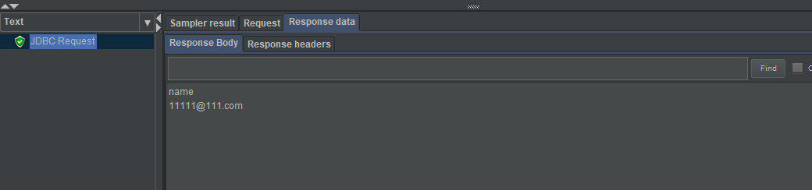

### 使用参数的例子

JDBC Request

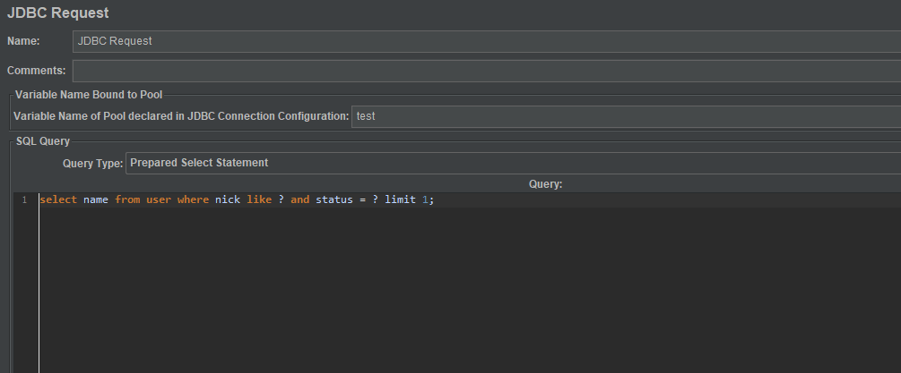

运行结果：

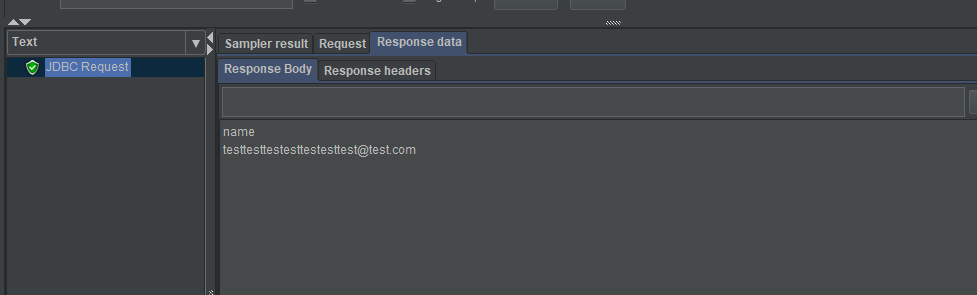

**注意**:

+ Parameter value、Parameter type 填写**值的数量要与语句中的参数个数保持一致**，用,分隔
+ 问号是**占位符**，可以**避免 SQL 注入**的问题
+ SQL 中**使用占位符**时，**Query Type** **必须选择** Prepared Select Statement 或者 Prepared Update Statement 
+ 如果在 Parameter values 中使用变量，且是字符串类型，不需要加上引号，只需要在 Parameter types 里写明为 varchar 即可

### 使用变量的例子

JDBC Request

在测试计划中添加一个用户自定义的变量：nick

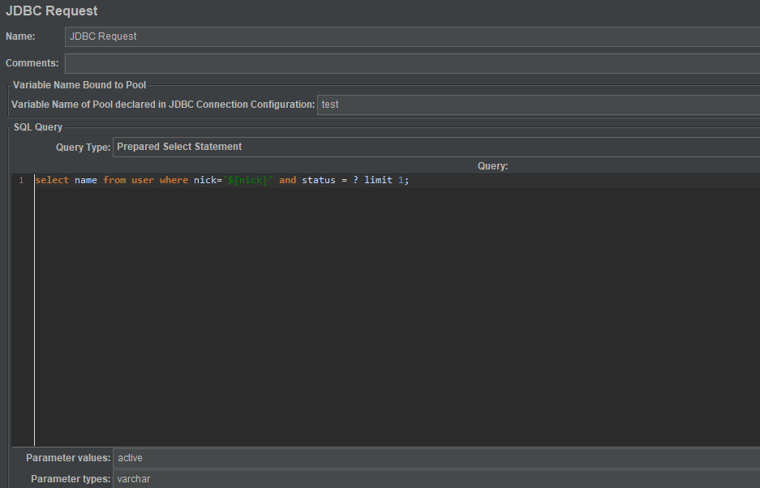

运行结果：

**重点**:

- 如果在 SQL 语句中使用变量，且是字符串类型，需要加上引号（前提是变量值没有加引号），如 `${nick_name}`

## 使用 Variable Names 的例子

JDBC Request

这里添加了 Debug Sample

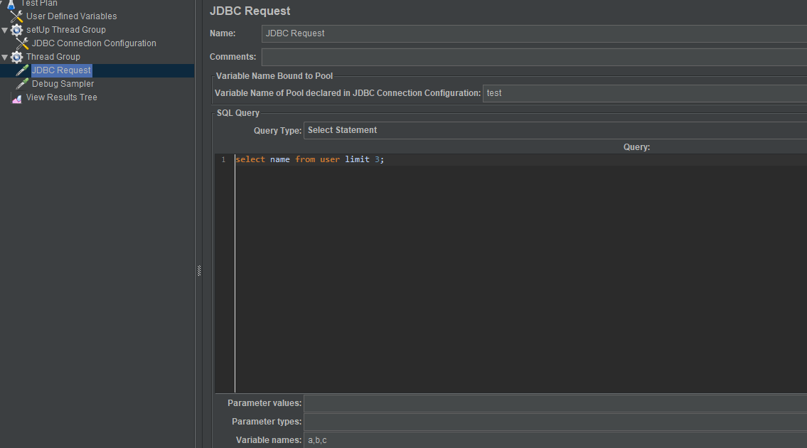

运行结果：

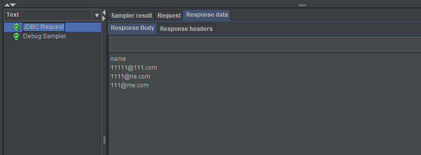

Debug Sample 结果：

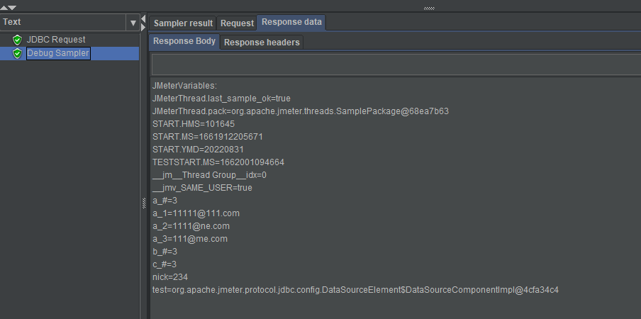

**重点**：

- test：数据库连接池对象
- `a_#`、`b_#`、`c_#`、`d_#`：代表第几列，从第一列开始
- `a_#`=3：第一列取 3 行数据，因为 SQL 中限制了 limit = 3
- a_1：第 1 列、第 1 行
- b_2：第 2 列、第 2 行
- 以此类推....
- 一般如果 HTTP 请求需要用到 SQL 查出来的数据的话，就会用到 Variable names 这个字段

## 使用 Result variable name 的例子

JDBC Request

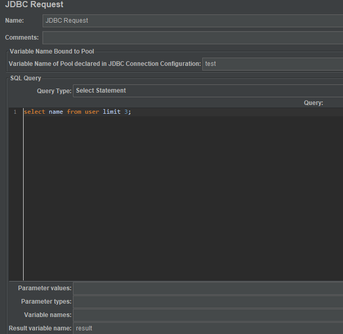

运行的 Request 结果和 Debug Sample 的结果：

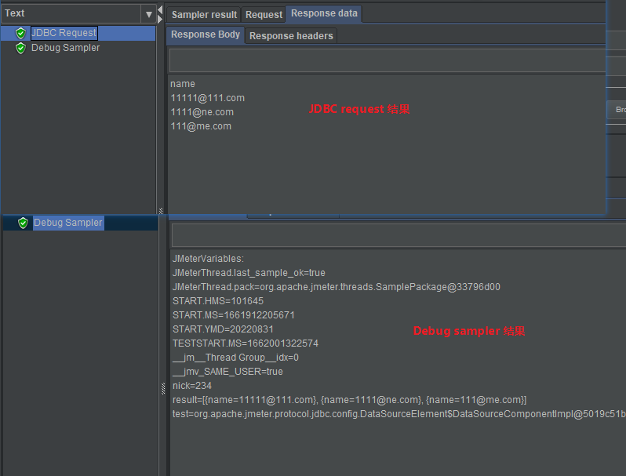

**注意**：Result variable name 的结果是一个数组，每个元素代表一个记录

## 使用 Limit ResultSet 的例子

JDBC Request

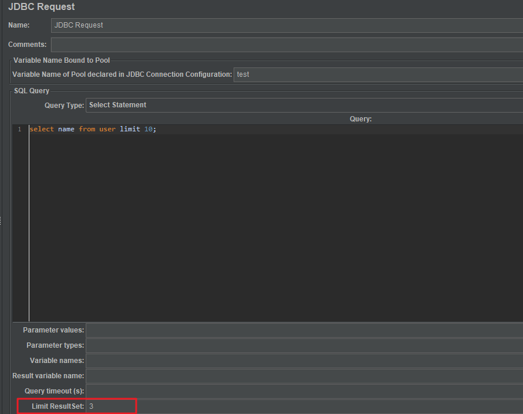

运行结果：

**重点**：

+ Limit ResultSet 是对 SQL 语句返回的结果集限制行数
+ `imit 10` 限制只返回了 10 条数据，然后 `Limit ResultSet = 3` 限制结果集最终只返回 3 条数据

（完）