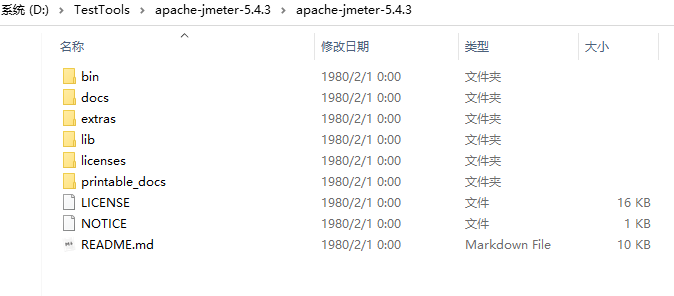
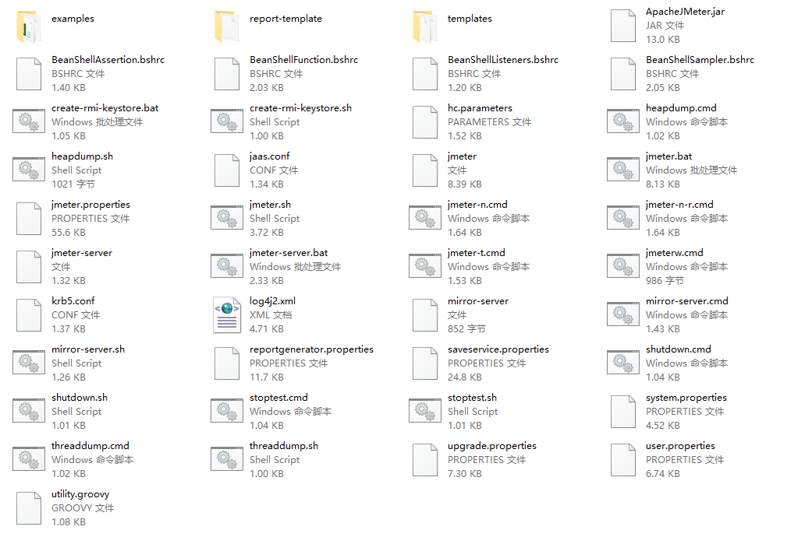

# 目录介绍

## JMeter 安装目录说明

JMeter 版本：5.4.3

[

| 文件夹         | 作用                                                         |
| -------------- | ------------------------------------------------------------ |
| bin            | 包含启动、配置等相关命令自己写的脚本默认另存为该目录下       |
| docs           | 官方接口文档，二次开发需要了解的一些接口                     |
| extras         | 辅助库，持续集成会用到（后面讲）                             |
| lib            | 存放各种 JMeter 核心库的源码 jar 包存放自己二次开发的 jar 包 |
| lib\ext        | 官方提供的第三方插件                                         |
| license        | 包含 non-ASF 软件的许可证                                    |
| printable_docs | 离线的帮助文档，可以查看函数等内容                           |
| LICENSE        | JMeter 许可说明                                              |
| NOTICE         | JMeter 简单信息说明                                          |
| README.md      | JMeter 官方基本介绍                                          |

### bin目录(重点)

| 文件              | 作用                                                         |
| ----------------- | ------------------------------------------------------------ |
| jmeter.properties | JMeter 核心配置文件，各种配置基本在这完成                    |
| log4j2.xml        | JMeter 日志配置管理                                          |
| jmeter.log        | JMeter 运行日志记录，什么输出信息、警告、报错都在这里进行了记录 |
| jmeter.bat        | windows 下 JMeter 的**启动**文件，**带 **cmd 窗口            |
| jmeterw.cmd       | windows 下 JMeter 的**启动**文件，**不带** cmd 窗口          |
| shutdown.cmd      | windows 下 JMeter 的**关闭**文件                             |
| stoptest.cmd      | windows 下 JMeter 停止测试的文件                             |
| jmeter-server.bat | windows 下 JMeter 服务器模式的启动文件                       |
| jmeter-server     | mac 或者 Liunx 分布式压测使用的启动文件                      |

### docs 目录

主要是 JMeter 的接口文档目录

可以打开页面查看

### extras 目录

扩展插件目录

### lib 目录

jar 包存放的目录

- lib：存放 JMeter 所依赖的外部 jar
- lib\ext：存放 JMeter 所依赖的核心 jar,插件包也在此目录下
- lib\junit：存放 Junit 测试脚本

### Licenses 目录

JMeter 证书目录

### Printable_docs目录

`Printable_docs` 的 usermanual 子目录下的内容是 JMeter 的用户手册文档

usermanual 下 `component_reference.html` 是最常用到的核心元件帮助文档

（完）