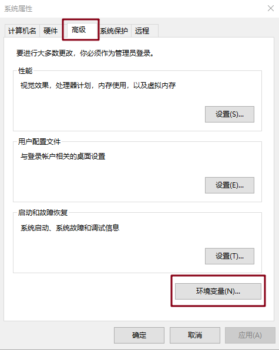

# Jmeter 安装

## 下载

http://jmeter.apache.org/ 下载最新版本的 JMeter，解压文件到任意目录

**注意**：不要放在**含有中文**的目录下

## 安装依赖环境

### JDK 安装

#### 下载

https://www.oracle.com/java/technologies/javase-jdk8-downloads.html

下载成功后进行安装，记住安装的目录

#### 配置 Java 环境

+ 在高级设置中点击环境变量选项

  

+ 在环境变量中添加新建一个 JAVA_HOME 变量，设置之前安装 JDK 的目录

  

+ 将 JAVA_HOME 配置到 path 中

  

+ 点击确定后，Java 环境变量就安装好了，可以在 cmd 中运行命令进行查看

  

### 配置 JMeter 环境

#### 下载

https://jmeter.apache.org/download_jmeter.cgi 下载 .zip 的文件

下载完成后解压，

#### 打开界面

可以有两种方式打开

+ 执行 .bat 文件

在目录中 bin 目录下双击 jmeter.bat 即可打开

+ 配置 JMeter 环境

  类似于配置 Java 的环境，新建 JMeter 的变量，并添加进 path 中

  在 cmd 窗口中输入 jmeter，即可打开 JMeter 

  

  上述操作 cmd 窗口会一直显示，如果想要关闭，可以输入 jmeterw，此时就不会显示 cmd 窗口了

### JMeter 运行原理

+ JMeter 是运行在 jvm 虚拟机上的
+ JMeter 是以线程的方式运行的，减少负载机
+ JMeter 通过线程组驱动多个线程执行
+ GUI 模式一般用来调试，压力测试一般在非 GUI 模式下进行

（完）