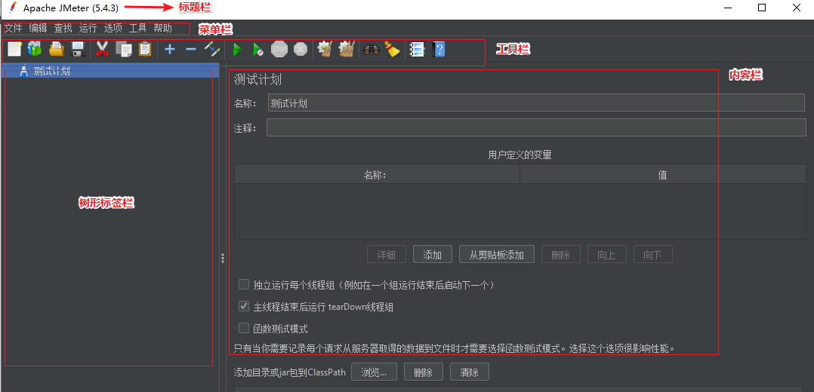

# JMeter 界面介绍

**主页面布局**：

JMeter 的主界面布局分为标题栏、菜单栏、工具栏、树形标签栏和内容栏

+ 标题栏：主要显示计划信息及 JMeter 版本
+ 菜单栏：全部的功能都包含在菜单栏中
+ 工具栏：工具栏中的按钮在菜单栏都可以找到，显示了常用功能的快捷按钮
+ 树形标签栏：显示测试计划相关的标签
+ 内容栏：配合树形标签显示，选中哪个标签，内容栏中就显示相应内容和操作

（完）