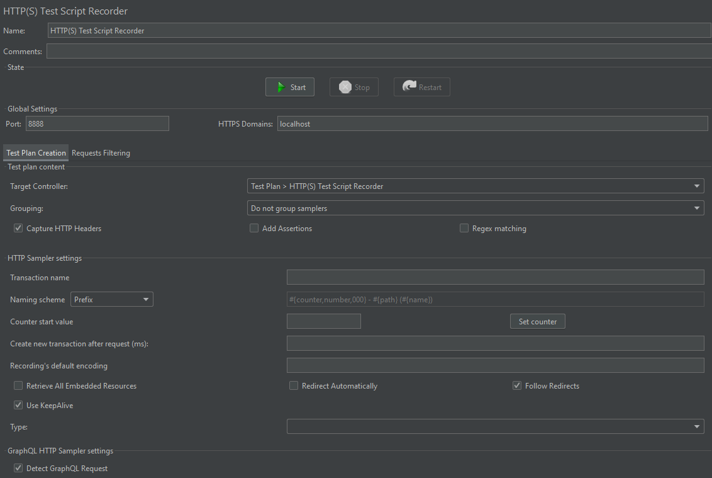
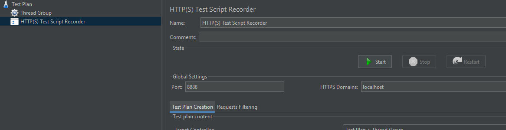
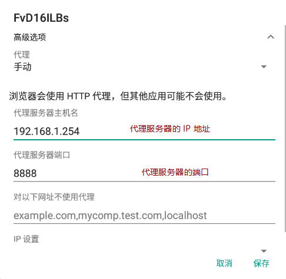
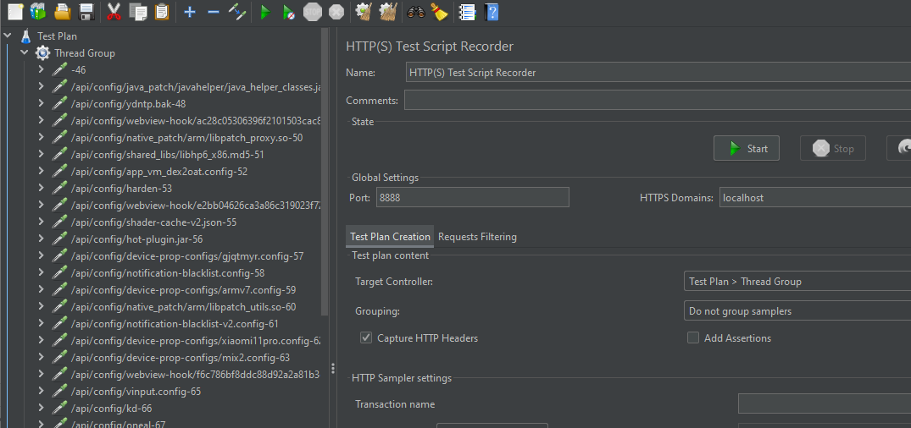

# JMeter 录制脚本

需要使用 JMeter 的代理服务

## 代理服务界面：

测试计划中邮件添加非测试元件：

参数说明：

**State**：

代理服务器的状态

**Global Settings**：

| 参数          | 说明                                       |
| ------------- | ------------------------------------------ |
| Port          | JMeter 作为代理服务器的端口号              |
| HTTPS Domains | 添加 HTTPS 请求的域名，如果有多个用 , 隔开 |

**Test Plan Creation**：

test plan content：

| 参数                | 说明                                                         |
| ------------------- | ------------------------------------------------------------ |
| Target Controller   | 录制脚本保存的节点                                           |
| Grouping            | 分组方式： 不对样本分组，请求什么就记录什么 在组间添加分隔，每一个 sampler 结束都会有分隔符间隔开 每个组放入一个控制器，在每个 sampler 请求开始时会生成一个简单控制器 只存储每个组的第一个样本，每个 sampler 请求时，如果有子请求，不会记录子请求 每个 sampler 请求开始时会生成一个事务控制器 |
| Capture HTTP Header | 勾选，请求时会记录 HTTP 信息头                               |
| Add Assertions      | 勾选，请求时会记录断言                                       |
| Regex matching      | 正则表达式匹配                                               |

HTTP Sampler settings:

| 参数                                     | 说明 |
| ---------------------------------------- | ---- |
| Transaction name                         |      |
| Naming scheme                            |      |
| Counter start value                      |      |
| Create new transaction after request(ms) |      |
| Recording`s default encoding             |      |
| Retrieve All Embedded Resources          |      |
| Redirect Automatically                   |      |
| Follow Redirects                         |      |
| Use KeepAlive                            |      |
| Type                                     |      |

GraphQL HTTP Sampler settings:

| 参数                   | 说明 |
| ---------------------- | ---- |
| Delete GraphQL Request |      |

**Requests Filtering**:

Content-type filter:

| 参数    | 说明                                    |
| ------- | --------------------------------------- |
| Include | Content-type 包含模式，填的是正则表达式 |
| Exclude | Content-type 排除模式，填的是正则表达式 |

URL Patterns to Include:

| 参数                    | 说明         |
| ----------------------- | ------------ |
| URL Patterns to Include | URL 模式包含 |

URL Patterns to Exclude:

| 参数                    | 说明 |
| ----------------------- | ---- |
| URL Patterns to Exclude |      |

Notify Child Listeners of filtered samplers:

| 参数                                        | 说明                                             |
| ------------------------------------------- | ------------------------------------------------ |
| Notify Child Listeners of filtered samplers | 后台监听 sampler，app 后台运行时有请求时需要勾选 |

## 录制实例

以录制移动端脚本为例

+ 代理端口号设置为 8888，HTTPS Domain 为 localhost（代表运行 JMeter 的机器作为代理服务器），其余设置默认，点击 start 按钮启动

+ 设置移动端代理

  **注意**：移动端连接的网络必须要和代理服务器在**同一网络**

  

+ 设置完成后，进行录制，可以在 Thread Group 下生成脚本，可以对录制的脚本进行回放

  

代理录制 Web 端时，同样需要设置浏览器代理