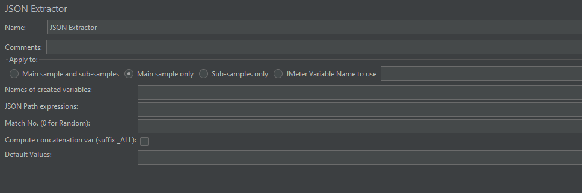
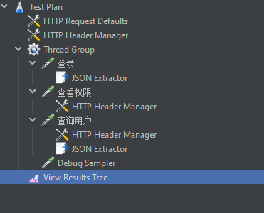
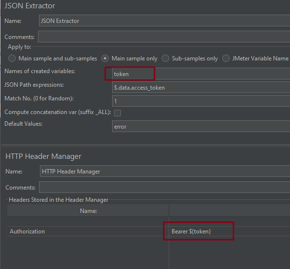
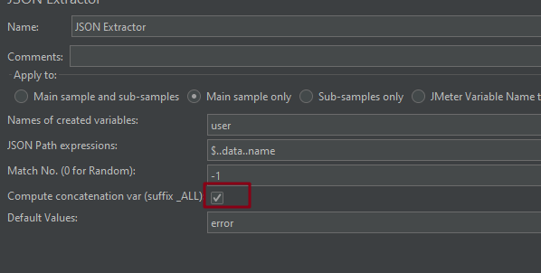
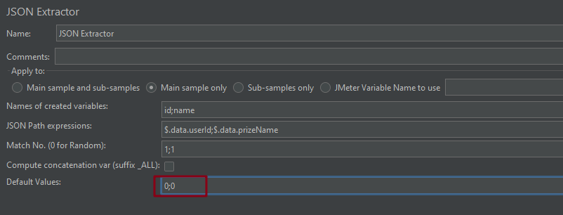

# JSON 提取器

位置：后置处理器中

## 什么是 JSON 提取器

用来提取 JSON 数据的一种方式

## 为什么要用 JSON 提取器

- JSON 是目前大多数接口响应内容的数据格式
- 在接口测试中，不同接口之间可能会有**数据依赖**，在 Jmeter 中可以通过后置处理器来提取接口的响应内容
- JSON 提取器是其中一个可以用来提取响应内容的元件

### JSON 提取器的应用场景
+  提取某个特定的值
+  提取多个值
+  按条件取值
+  提取值组成的列表

## 界面介绍



字段介绍：

| 字段                                  | 说明                                                         |
| ------------------------------------- | ------------------------------------------------------------ |
| Apply to                              | 应用范围，默认是 Main sample only                            |
| Names of created variables            | 提取值的变量名<br />多个变量使用 `;` 分隔<br />必填项        |
| JSON Path expressions                 | JSON Path 表达式，提取某个值<br />多个表达式用 `;` 分隔<br />必填项 |
| Match No.(0 for Random)               | 获取提取的值：<br />0：代表随机取<br />-1：表示取所有值<br />1：取第一个值<br /><br />若值大于匹配总数，在设置了缺省值的情况下返回缺省值，否则返回空<br />非必填项 |
| Compute concatenation var(suffix_ALL) | 如果匹配多个值，将使用 `,` 分隔符将他们连接起来并存储<br />存储在名为 `<variable name>_ALL` 的 var 中 |
| Defaults Values                       | 缺省值，匹配不到时取改值，可写 error<br />非必填项           |

## JSON 提取器实例

在介绍例子之前，首先先来学习下 JSON Path 的语法

### JSON Path 语法

+ $: 代表整个 JSON 数据，根节点
+ . : 代表下个节点

### 实例应用

测试结构树：



查看用户接口需要在请求头中添加登录后获取的 token，配置如下：



#### 提取单个值

| JSON Path                              | 结果 |
| -------------------------------------- | ---- |
| $.data.total(绝对路径方式)             | 3    |
| $..total(相对路径方式)                 | 3    |
| $..users[0].role                       | user |
| $.data.users[0].ext_info.yesapi_points | 0    |

##### 切片提取单个值
与 Python 中的切片类似
| **JSON Path** | **结果**              |
| ------------- | --------------------- |
| $..name[2]   | 第三个 name          |
| $..name[-2]  | 倒数第二个 name       |
| $..name[0,1] | 前面两个 name         |
| $..name[:2]  | 第一、二个 name       |
| $..name[1:2] | 第二个 name           |
| $..name[-2:] | 倒数两个 name         |
| $..name[1:]  | 第二个开始的所有 name |

#### 提取多个值
**注意**: 提取多个值时 Match No. 必须填 -1

```
以下几种几种方式均可：
$..name
$.data[*]..name
$..[*].name
$.data..name
```

**重点**:

+ **不能**通过取下标的方式（ name[0] ）来获取值，因为默认是获取 **ASCII码大**的那个值 ，除非提取器设置了 Match No
+ 调用变量时，不再是 ${name} 而是 ·${name_1} 、 ${name_2} 

#### 按条件取值

格式：

```
[?(expression)]
```

例子：

| JSON Path                                      | 结果                                          |
| ---------------------------------------------- | --------------------------------------------- |
| $..data[*].[?(@.name=="xiaoai")]               | 提取 name 等于 “xiaoai” 的记录                |
| $..data[*].[?(@.lastLoginTime > "2021-07-20")] | 提取 lastLoginTime 字段大于 2021-07-20 的记录 |
| $.data[?(@.total)]                             | 提取 data 中包含 total 字段的记录             |
| $..data[\*].[?(@.name=~/.\*xiaoai.\*?/)]       | 提取 name 中包含 “xiaoai” 的记录              |

 **@**：代表当前节点

**=~**

+ 后面跟正则表达式，如果想提取**包含指定字符**的值，可以使用此正则：/.*指定字符串.*?/i 
+  i 代表大小写不敏感

#### 勾选 Compute concatenation var

JSON 提取器



结果：

```
name_1=zhangsan
name_2=lisi
name_3=wangwu
name_ALL=zhangsan,lisi,wangwu
name_matchNr=3
```

#### 提取多个变量


**注意**：

提取多个变量时，`Default Values`  必须填写

（完）

