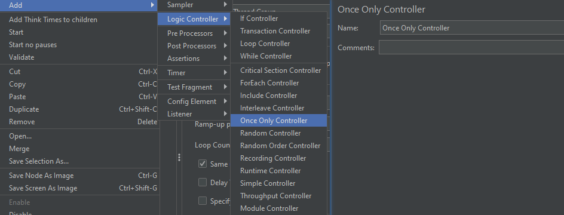
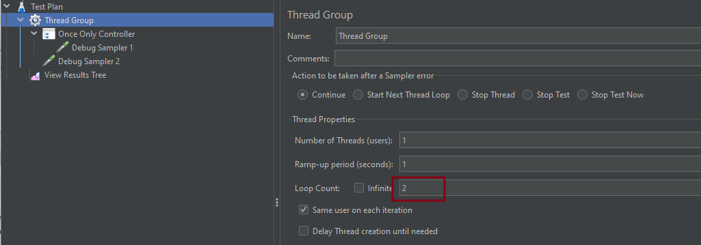
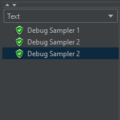
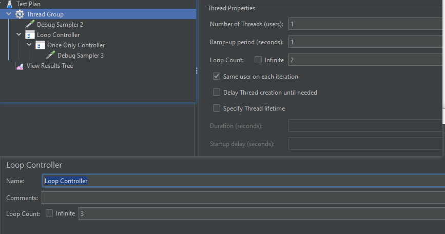
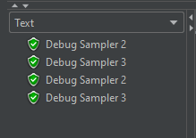

# Once Only 控制器

位置：逻辑控制器中

## 什么是 Once Only 控制器

+ 每个线程内，该控制器下的内容只会被执行一次

+ 无论循环多少次，都只执行一遍

## 界面介绍

## 实例介绍

### 简单例子

测试结构树 + 线程组设置：

测试结果：

上面结果说明，Once Only Controller 中的取样器只执行了 1 次

### Once Only Controller + Loop Controller

测试计划结构树 + 线程组配置 + Loop 控制器配置

测试结果：

- 仅在通过循环控制器的第一次迭代中执行控制器里面的内容
- 而循环控制器会执行 2 次，所以仅一次控制器也会执行 2 次

**应用场景**：

+ 对于需要登录的测试，可以将登录请求放置在此控制器中，因为每个线程只需要登录一次即可建立会话

（完）