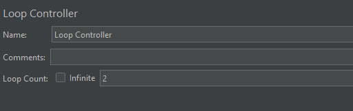

# Random 控制器

作用：其下的子项会被随机执行

应用场景：做容量测试的时候，随机分配业务比例，最大程度的模拟用户场景

## 界面介绍

**Ignore sub-controller blocks**：忽略子控制器，勾选后，随机控制器下的子控制器中的多个子项只会被执行一个

## Random Controller 实例

### 未勾选 Ignore sub-controller blocks

测试计划结构树 + 测试结果：

可以看到取样器随机执行

### 勾选 Ignore sub-controller blocks

测试计划结构树 + Random Controller：

Loop Controller：

测试结果：

可以看到上述结果：

+ 如果随机到循环控制器时，只会执行了一次
+ 循环控制器中按照依次执行的顺序选择了第一个执行

（完）