# 正则提取器

位置：后置处理器中

## 什么是正则提取器

使用正则表达式来获取数据的一种方式

## 为什么需要正则提取器

+ JSON 提取器**只针对**接口返回且数据格式为 JSON 的响应内容
+ 如果想提取的是响应头、请求头的值，而非响应内容的值呢？
+ 这个时候正则提取器的作用就出来了，它可以提取请求任一部分的值

## 界面介绍

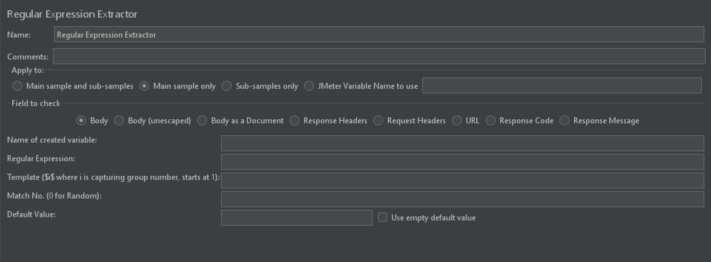

字段介绍：

| 字段                       | 说明                                                         |
| -------------------------- | ------------------------------------------------------------ |
| Apply to                   | 1. 作用于主节点的取样器及对应子节点的取样器 2. 仅作用于主节点的取样器（一般默认） 3. 仅作用于子节点的取样器 4. 作用于 JMeter 变量，**从指定变量值中提取需要的值** |
| Field to check             | 1. 响应报文的主体，最常用 2. 替换了所有的 HTML 转义符的响应主体内容，HTML 转义符处理时不考虑上下文，因此可能有不正确的转换，**不太建议使用** 3. 从不同类型的文件中提取文本，**注意这个选项比较影响性能** 4. 响应信息头 5. 请求信息头 6. 请求url 7. 响应状态码 8. 响应信息 |
| Names of created variables | 接收提取值的变量名 必传                                 |
| Regular Expression         | 正则表达式                                                   |
| Template                   | 从找到的匹配项中创建字符串的模板                             |
| Match No.(0 for Random)    | 取第几个值  0：随机，**默认**  -1：所有   1：第一个值 非必传 |
| Default Value              | 缺省值，匹配不到值的时候取该值  非必传                  |
| Use empty default value    | 勾选后，提取不到值时，则返回空字符串                         |

**Template 注意**：

- 如果**一条**正则表达式有**多个提取结果**，则提取结果是数组形式
- 模板 `$1$`、`$2$`.....表示把解析到的第几个值赋给变量，从 1 开始匹配
- `$0$` 表示整个表达式匹配的内容
- 若只有一个结果，只能是$1$

## 正则提取器实例

在介绍例子之前，首先先来学习下 正在表达式的语法

### JSON Path 语法

有关于正则表达式的了解，可以参考[正则表达式](/basic-skills/regular/regular)

### 实例应用

测试结构树：

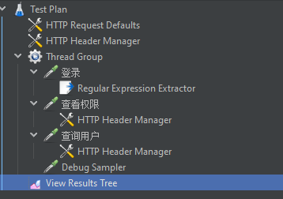

查看用户接口需要在请求头中添加登录后获取的 token，配置如下：

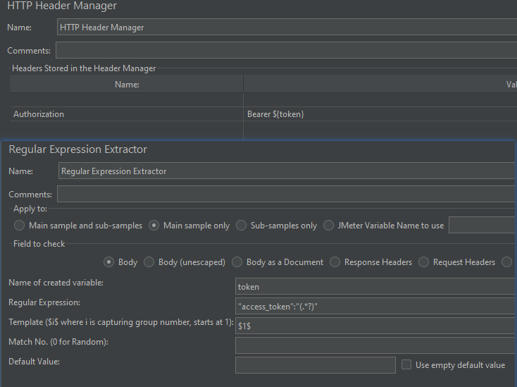

**知识点**:

-  `( )` 里面写匹配规则，用于解析正则表达式
-  `.*?` 表示匹配任意长度的任意字符，这也是最常用的正则表达式
- 一般` (.+?)` 和 `(.*?)`能够满足我们 **80%** 的使用场景
- 一般正在表达式可以写成 `左边界(.+?)右边界` 或 `左边界(.*?)右边界` 

#### 一条正则表达式提取一个结果
##### 未填写模板
提取器：

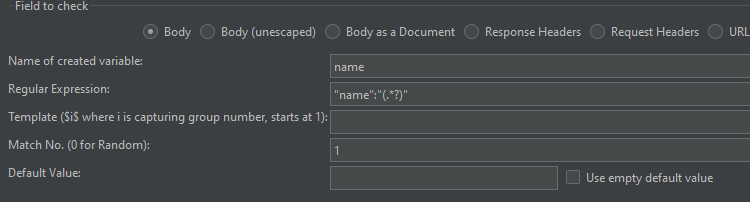

测试结果：

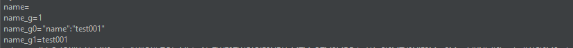

**注意**：如果正则匹配到值，但是没有填模板，则返回空

##### 添加模板
###### $0$
提取器：

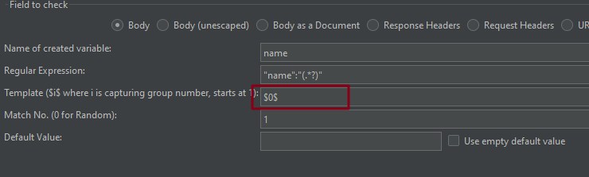

测试结果：

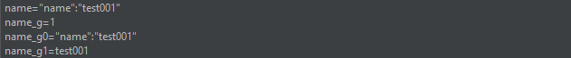

上面测试结果表示：

+ `$0$` 模板其实返回的就是 `name_g0` 的值
+ 返回了整个正则表达式，不只是 ( ) 内匹配到的值

###### $1$
提取器：

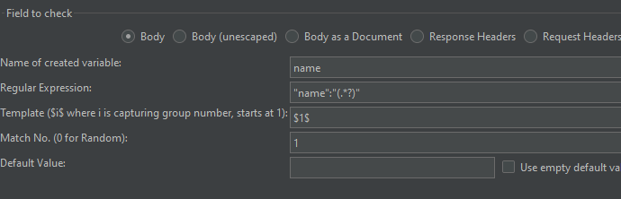

测试结果：

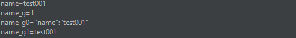

上面测试结果表示：

+ `$1$` 模板其实返回的就是 `name_g1` 的值
+ 仅返回 ( ) 内匹配到的值

###### $2$
提取器：

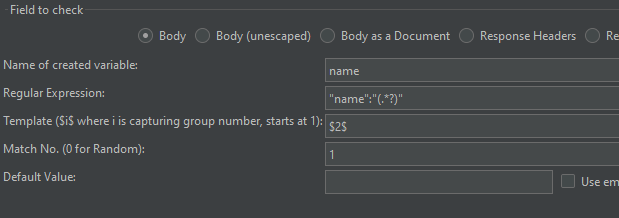

测试结果：

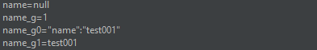

上面测试结果表示：

+  `$2$` 模板并不存在，其实就是` name_g2` 变量不存在，即使勾了使用空默认值，也返回 null

**小结**：

+ 其实 name 在 JSON 字符串中有三个可匹配到的值，如果不填写匹配数字 Match No. ，则会随机取一个 name 并返回
+ 像上述的几个例子，都填了 1 ，所以都返回了第一个匹配到的 name

#### 一条正则表达式提取多个结果

有 2 种情况：

+ 一条表达式有多个 ( ) 
+ 一个 ( ) 匹配到多个值，且 Match No 填了 **-1**

##### 一个 ( ) 匹配到多个值

提取器：

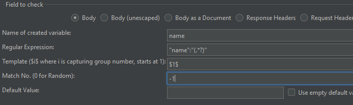

运行结果：

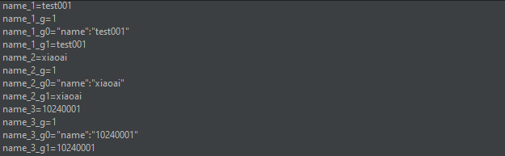

可以搭配 ForEach 控制器获取相应的值：

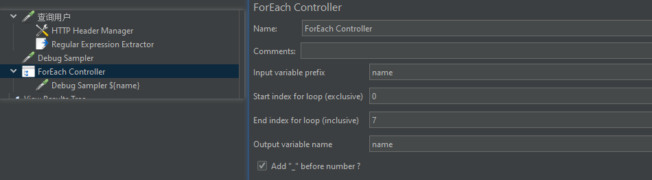

运行结果：

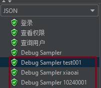

##### 一条表达式有多个 ( )

###### 无模板

提取器：

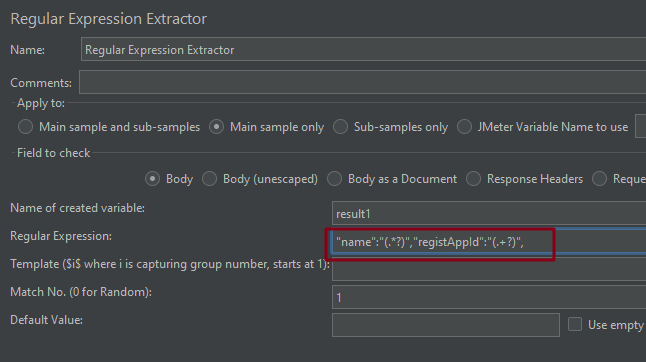

结果：

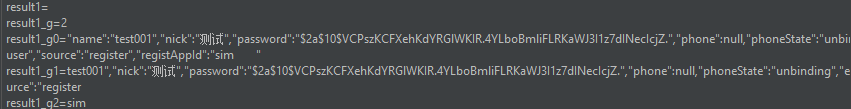

###### 只有一个模板

提取器：

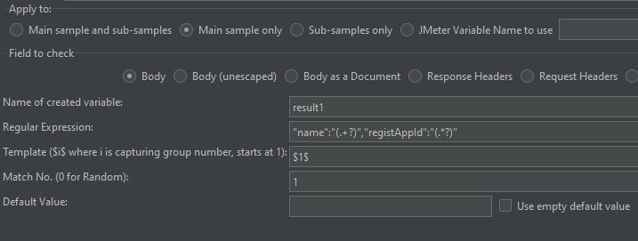

结果：

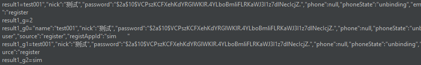

根据上面结果发现：

- result1 拿的就是 `result1_g1` 的值
-  `$1$` 获取的是第一个 ( ) 匹配到的值，`$2$` 获取的是第二个 ( ) 匹配到的值，以此类推 

###### 有 2 个模板

提取器：

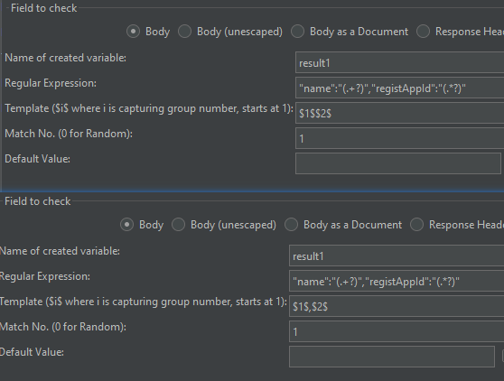

上面 2 种方式的结果一样：

**小结**：

- 如果其中一个 ( ) 匹配不到元素，那也无法获取到值
- **引用名称、匹配数字、缺省值**三个字段也只需要填一个值即可，不需要跟 ( ) 的数量一致
- 多个模板（ $1$$2$ ）的时候，可以用空格、`,` 、`.` 、` - `连接模板，最终会显示在变量上

（完）