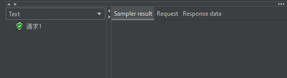

# Switch Controller

作用：控制该控制器下的取样器执行

应用场景：可以用在模拟多线程同时操作不同请求的测试场景

## 界面介绍

Switch Value：

+ 数字
  + 0 表示运行 Switch 控制器里的第一个请求，1 表示运行第二个请求以此类推
  + 数字超过取值范围了，就默认是 0
  + 不填：默认执行数字 0 的请求，即顺位第一个请求
+ 字符：输入 Switch 控制器里面请求的名称，匹配与请求中的名称相同则执行该请求
+ 变量

## 实例

### 填入数字

#### 不填

测试计划结构树 + Switch：

测试结果：

执行了第一个请求

#### 数字在范围内

测试计划树结构 + Switch ：

测试结果：

执行了第 2 个请求

#### 数字不在范围内

测试计划树结构 + Switch ：

测试结果：

执行了第 1 个请求

### 填入取样器名

测试计划树结构 + Switch ：

测试结果：

执行了第 1 个请求

### 变量

测试计划树 + Switch + 用户自定义变量：

测试结果：

随机获取数字，随机执行请求

（完）