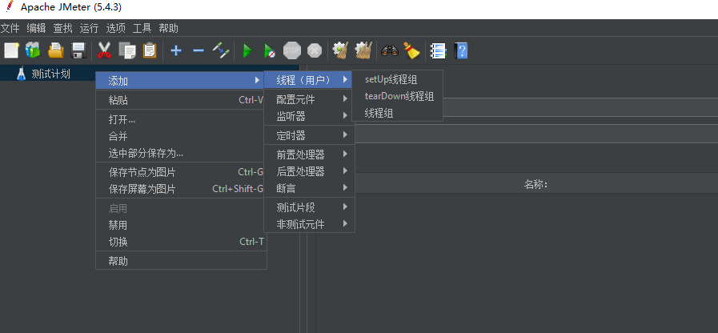
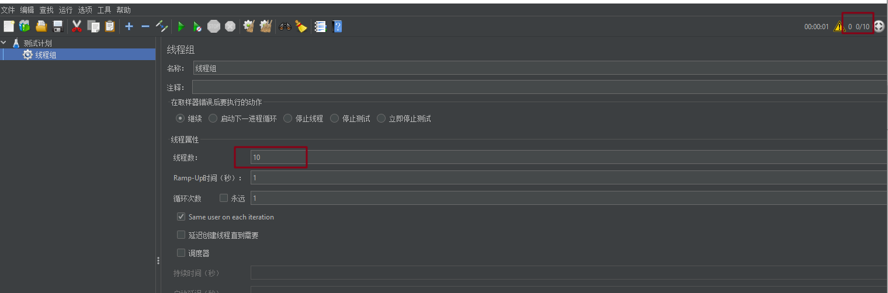
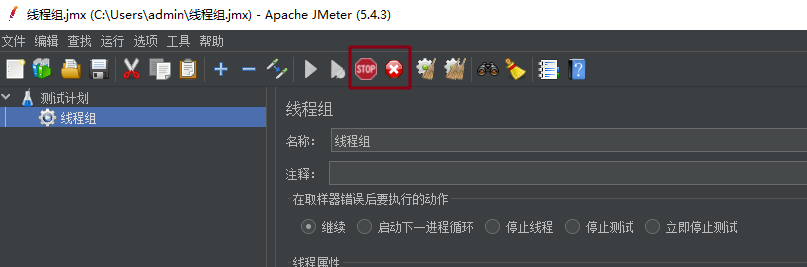
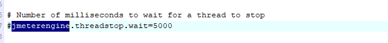
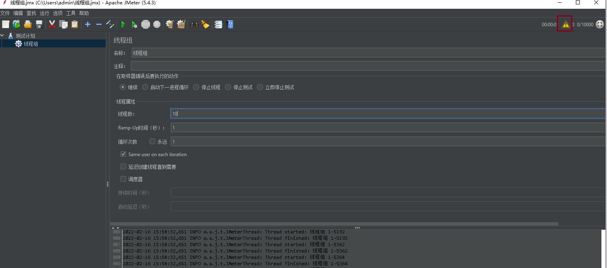

# 测试计划 

## 测试计划的作用

- 测试计划描述了 JMeter 在执行时，一系列的步骤
- 一个完整的测试计划包含了一个或多个【线程组、逻辑控制器、采样器、监听器、定时器、断言和配置元素】

 

## 测试计划添加/删除元件

- 通过右键点击树中的元件，选中要添加的元件
- 也可以通过合并（merge）或打开（open）从文件中加载和添加元件
- 删除一个元件，请确保选中了该元件，右键单击该件素，并选择**删除（remove）**选项

 

## 配置树元素

- 树中的每一个控件都能通过右边内容区显示
- 树中的每一个控件都能在树中随意拖动

## 保存测试计划

+ 建议在执行之前保存测试计划

+ 从文件菜单中选择 save 或 save Test Plan As… 进行保存

## 执行测试计划

- 可以通过 `ctrl+r` 运行测试计划
- 通过右侧的数字：**活动线程数/线程总数**，这仅适用于本地运行的测试
- 使用客户端-服务器模式时，它们不包括在远程系统上启动的任何线程**【分布式压测时，master 机不会显示所有远程 salve 机的线程总数】**

 

### 特别注意

仅在**调试**测试计划时，才应该使用上面的 GUI 模式**【界面模式】**，如果实际运行**负载测试**的时候，应该使用 CLI 模式**【命令行模式、无界面模式】**

 

## 暂停运行测试计划

两种暂停方式

- 停止线程（ctrl + .）**【硬中断】**
- 关闭线程（ctrl + ,）**【软中断】**

### stop

- 许多采样器（Samplers）都是可中断的，这意味着可以提前终止活动采样
- stop 命令将检查所有线程是否已在默认超时（即 5000 ms = 5 秒）内停止
- 如果有线程还没被停止，则会发送一条信息；此时可以再发送一次 stop 命令，但如果还是失败的话，就得退出 Jmeter 来清理

 

### 特别注意

上述说的默认超时可以通过 JMeter 属性来改变 `jmeterengine.threadstop.wait` **【jmeter安装目录 / bin / jmeter.properties】**

[]

 

### shutdown

- 线程会在当前运行任务结束后停止，**不会中断**活动线程正在执行的任务

- 会出现一个【正在停止测试】的窗口（如下图），直到所有线程都运行完成了才会关闭

- 如果停止时间太久，也可以直接发 stop 命令

  

### 注意点

- 在 **Linux CLI** 模式下，是没有快捷键来停止线程运行的，所以 JMeter 在 CLI 模式下会监听特定端口上的命令（默认端口 4445，可以通过 `jmeterengine.nongui.port` 修改）
- 如果 4445 端口被占用了（比如，另一个 JMeter 实例用了），JMeter 会自动选择备用端口；
- JMeter 将尝试监听下一个更高的端口，直到到达 JMeter 属性 `jmeterengine.nongui.maxport` 为止，该属性默认为 4455

 

## 在 CLI 模式下，如何停止线程执行

在bin目录下，运行脚本

+ stoptest.cmd / stoptest.sh **【硬中断】**

+ shutdown.cmd / shutdown.sh **【软中断】**

**注意，**只有在同一个 host 下运行的脚本，JMeter 才会接受

## 错误报告

+ JMeter 向 **JMeter.log** 文件报告警告和错误，以及测试运行本身的一些信息
+ JMeter 显示在 **JMeter.log** 文件中发现的警告/错误数量
+ 单击警告图标，就可以显示 JMeter窗口底部的 **jmeter.log** 文件
+ 偶尔会出现 JMeter 无法捕获和记录的错误，这些将出现在命令控制台上

**注意**：在日志文件中通常不报告抽样错误(例如没有找到的 HTTP 404 文件)

（完）