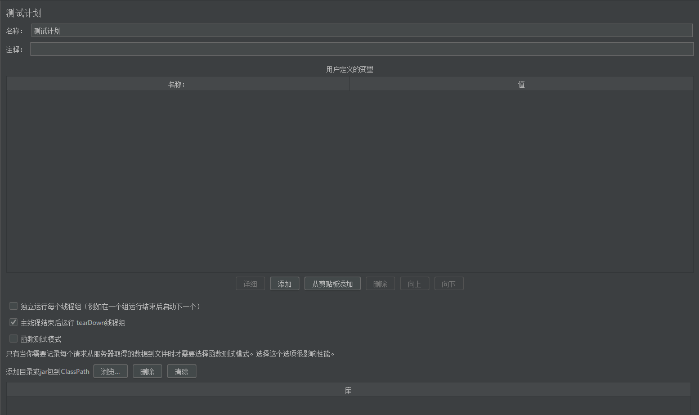
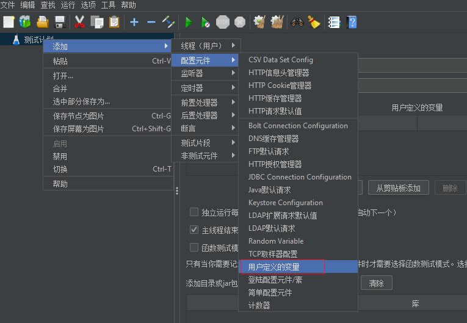
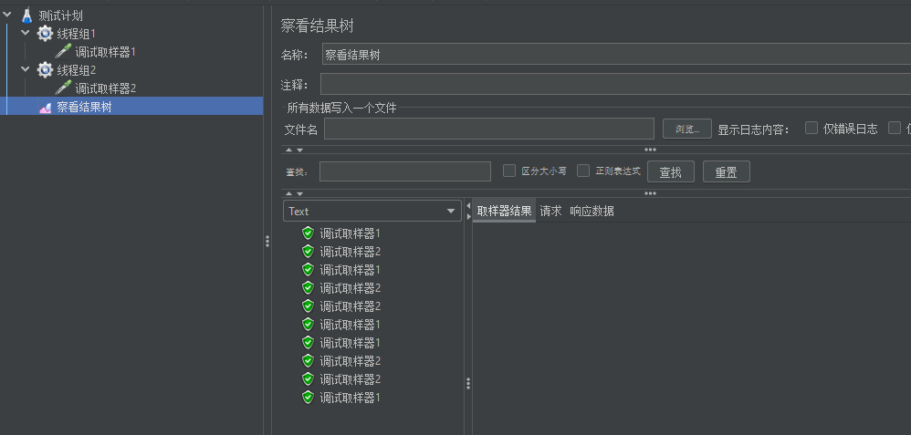
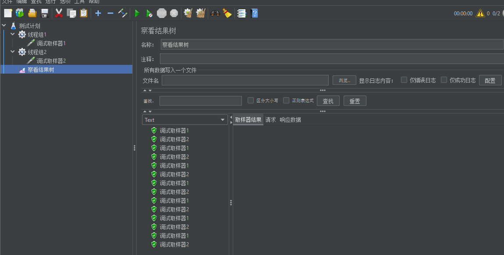
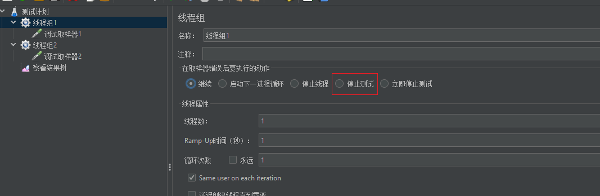
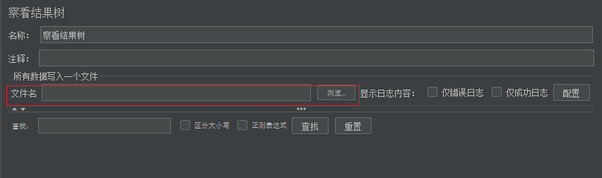

# 测试计划参数详解

## 测试计划参数

 

### 名称和注释

 整个测试脚本保存的名称，和对该测试计划的注释 

### 用户定义的变量

- 用户添加的变量，相当于全局变量，**所有线程组都共用**
- 一般添加一些系统常用的配置
- 一般不建议在测试计划上添加变量，因为不方便启用（disable）和禁用（enable）
- 可以添加用户自定义变量组件来代替，如下图

 

### 独立运行每个线程组

+ 用于控制测试计划中的多个线程组的执行顺序 

+ 不勾选，默认**各线程组并行、随机执行**

**作用：**勾选后，用于控制测试计划中的多个线程组的执行顺序，保证**顺序执行**各线程组

**下图是没有勾选时**，多个线程组执行的顺序，可以看到并不完全是顺序执行的

 

**下图是勾选后**，多个线程组的执行顺序，可以看到当执行完第一个线程组所有取样器才会执行第二个线程组的，按顺序执行

 

#### 特别注意

- 线程组中的**取样器执行顺序**：默认是从上到下执行
- 交替控制器、随机控制器、随机顺序控制器、循环控制器可以改变取样器的执行顺序

### 主线程结束后运行 tearDown 线程组
+ 当线程组停止运行时仍继续运行 tearDown 线程组
+ 该选项结合线程组的执行配置使用，如图所示，目前已很少使用

### 函数测试模式

勾选后，如果监听器（如：查看结果树）配置了保存到一个文件中（如下图），那么 JMeter 会将每次的请求结果保存到文件中

在负载测试中不建议勾选，平时调试脚本情况下可以勾选

### 添加目录或 jar 包到 classpath

当脚本需要调用外部的 java 文件或 jar 包时，可以把 jar 包路径添加到这里，然后在 BeanShell 中直接 import 进来，并调用 jar 包中的方法

（完）