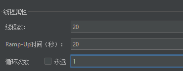
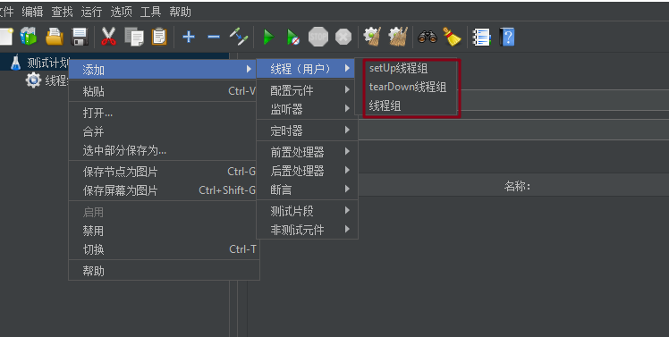

# 线程组

## 简介

### 什么是线程组

+ 是任何测试计划的起点，相当于业务流程
+ 所有控制器和采样器必须在一个线程组下
+ 线程组决定了 JMeter 测试计划中执行的线程数

### 作用

- 设置线程数
- 设置 ramp-up period
- 设置执行测试的次数

 ### 特点

每个线程将完整地执行测试计划，并且完全独立于其他测试线程，多线程用于模拟到服务器应用程序的并发连接 

## 线程组属性

### 在取样错误后要执行的动作

+ 继续(默认)：忽略错误，继续执行
+ 启动下一进程循环：忽略错误，线程当前循环终止，执行下一个循环
+ 停止线程：当前线程停止执行，不影响其他线程正常执行
+ 停止测试：整个测试会在所有当前正在执行的线程执行完毕后停止
+ 立即停止测试：整个测试会立即停止执行，当前正在执行的取样器可能会被中断

### 线程属性

#### 线程数

+ 模拟真实用户，1 线程 = 1 虚拟用户
+ windows 下，2g 的 java 内存，1m 的栈空间，最大启动线程数=1000
+ Linux 下，2g 的 java内存，1m 的栈空间，最大启动线程数=2000
+ 在 JMeter 中，先启动线程，再运行线程，后释放线程**【启动线程并运行，释放线程】**
+ **线程数建议不超过 1000**

#### Ramp-Up 时间

- 预期线程组的所有线程从启动-运行-释放的总时间
- `ramp up=0` 时，表示瞬时加压，启动线程的时间无限趋近于 0
- **特别注意**：在负载测试的时候，尽量**把 ramp up 设置大**一些，让性能曲线平缓，容易找到瓶颈点

##### 配置注意事项

###### Ramp-up需要设置足够长的时间来避免在测试刚开始时工作量过大

- 假如需要大量线程的话，不建议设置成 0，0 属于瞬时加压【过小的 ramp-up period 】
- 如果设置 0，JMeter 将在测试开始时就启动全部线程并立即发送请求，这样很容易让服务器达到饱满状态，且瞬间会增加很大的负载量，容易让服务器超载，这样是不合理的；
- 不合理的原因并不是因为平均压力值过高，而是因为所有线程都在**初始状态时一起并发访问**，从而引起不正常的初始访问峰值，可以通过 JMeter 的聚合报告看到这种情况

###### Ramp-up还必须足够短，保证最后一个线程在第一个线程完成之前开始运行

- 如果 Ramp-up 过大，则会降低访问峰值的负载，即没有达到预期的压力峰值，无法获取准确的服务器最大负载情况【过大的 ramp-up period 】
- **具体的表现为：**一些线程还没有启动，初期启动的部分线程已经结束了【导致实际并发量并会小于预期并发量】

###### 如何确定一个合理的 ramp-up period

- 首先，让初始点击率接近平均点击率，前提是确定合理的访问量
- 初始的 `ramp-up period = 平均点击率= 总线程/点击率`；`假如线程数=100`，`点击率=10次/s`，则 `ramp-up period = 100/10 = 10s`

#### 循环次数

- 每个线程循环执行的次数，**默认一次**，**值 != -1**
- 如果设置为**永远**，那么 JMeter 将以最大的可能去发送请求，以此测试出**最大并发数**

#### 线程配置例子

说明：20s 内启动并运行 20 个线程，一共启动 20 个线程，总共发送 20 个请求（10*2），每秒启动一个线程，然后运行 1次

**注意**：如果 ramp-up 时间内，所有线程不能启动运行完的话，时间则会顺延下去

#### Same user on each iteration

+ 【选中】默认选中，每次循环用第一次的 cookie，不再更新【可以理解为每次循环都是同一个用户】

+ 【不选中】每次循环都是用新的 cookie 值【可以理解为每次循环都是不同的用户】

#### 延迟创建线程直到需要

延迟创建线程，直到线程被需要、采样器开始执行时才会被创建，避免资源浪费

【选中】JMete将根据 Ramp-up 时间来分配线程。否则，无论 Ramp-up 时间如何设定，所有线程都将在测试开始时分配给 JVM 进程

#### 调度器

作用：控制每个线程组运行的持续时间以及它在多少秒后再启动

持续时间：线程组运行的持续时间

启动延迟：测试计划开始后，线程组的**线程**将在多少秒后**再启动运行**

**注意事项**：

+ 调度器只有在循环次数勾选永远或值为 -1 时，才会生效
+ 当线程组运行完持续时间后，会**逐步释放线程**，不会一下子把所有线程释放掉，而释放线程也是需要时间的
+ 测试计划总的时间（右上角的时间）会 > 持续时间+启动延迟

## 常见线程组

### 普通线程组

就是上面介绍的线程组

### setUp 线程组

+ 用于执行预测试操作的特殊线程组
+ 与普通线程组操作类似
+ **注意事项**：在普通线程组执行测试前被执行

**应用场景例子**：

+ 测试数据库操作功能时，用于执行打开数据库连接的操作
+ 测试用户购物功能时，用于执行用户的注册、登录等操作

### tearDown 线程组

+ 用于执行测试后操作的特殊线程组
+ 与普通线程组操作类似
+ **注意事项**：在普通线程组执行测试后被执行

**应用场景例子**：

+ 测试数据库操作功能时，用于执行关闭数据库连接的操作
+ 测试用户购物功能时，用于执行用户的退出等操作

（完）