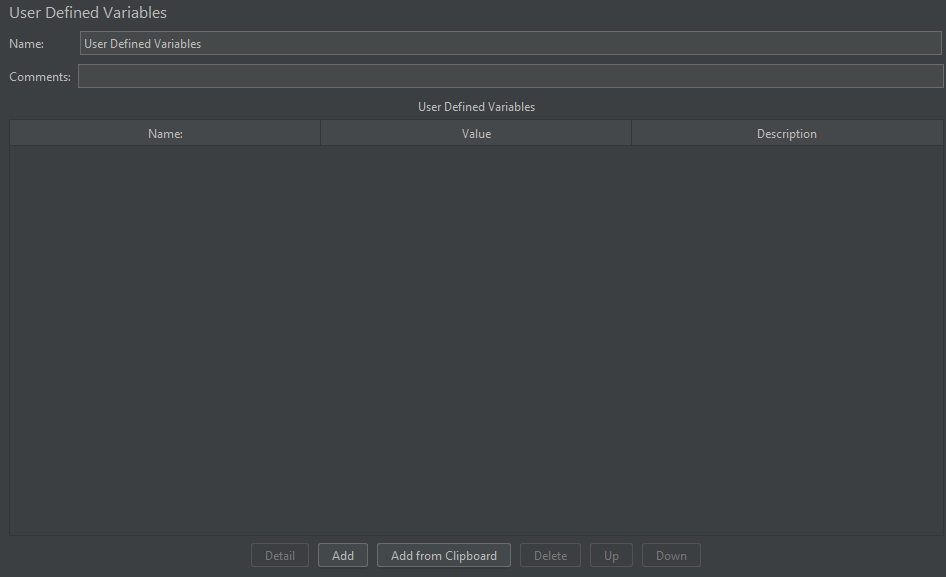
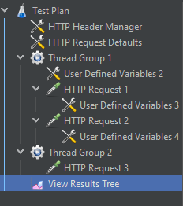
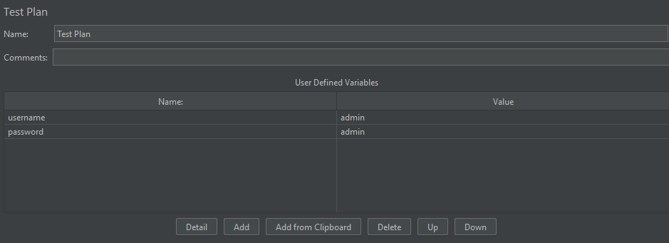
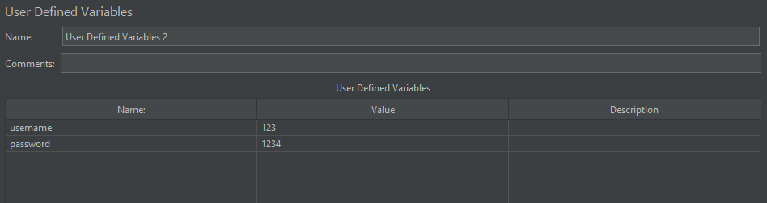
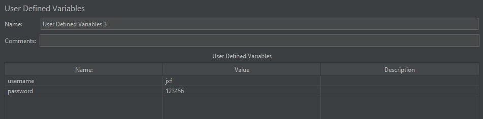
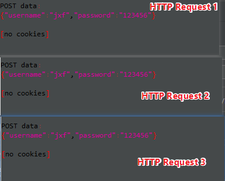
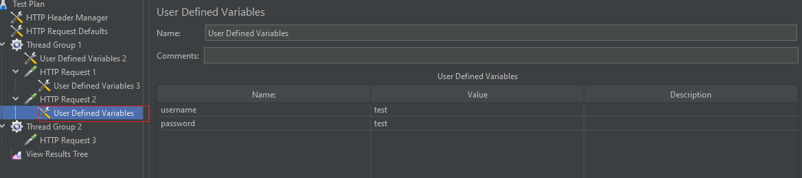
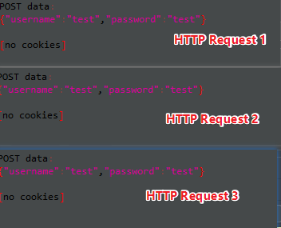
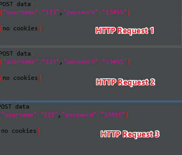

# 用户自定义的变量

适用于常量配置：数据库地址、测试环境地址等

位置：测试计划/配置原件

## 界面介绍

界面很简单，单击 Add 就可以新增变量

## 用户自定义变量实例

测试计划、线程组1、HTTP 请求下均添加用户自定义的变量

**第一个用户自定义变量设置（测试计划中）**:

**第二个用户自定义变量设置（线程组1 中）**:

**第三个用户自定义变量设置（HTTP Request 1中）**:

运行结果如下：

上述结果中发现，所有的 HTTP 请求的请求参数的值都一样

为了进一步验证，在 HTTP Request 2 下添加一个用户自定义参数

 运行结果如下：

结果显示使用了 HTTP Request 2 中设置的值

删除 HTTP 请求下的所有用户自定义的参数，运行结果：

结果显示使用了线程组1 中的参数

删除线程组中的用户自定义参数，可以自行实验

**总结**：

+ 用户自定义的参数作用于所有的 HTTP 请求
+ 用户自定义变量定义的参数定义后不会改变
+ HTTP 请求中的用户自定义的变量优先级**最高**，线程组的用户自定义参数 > 测试计划中的
+ 用户自定义参数会选取最新的值作用于所有 HTTP 请求上

（完）