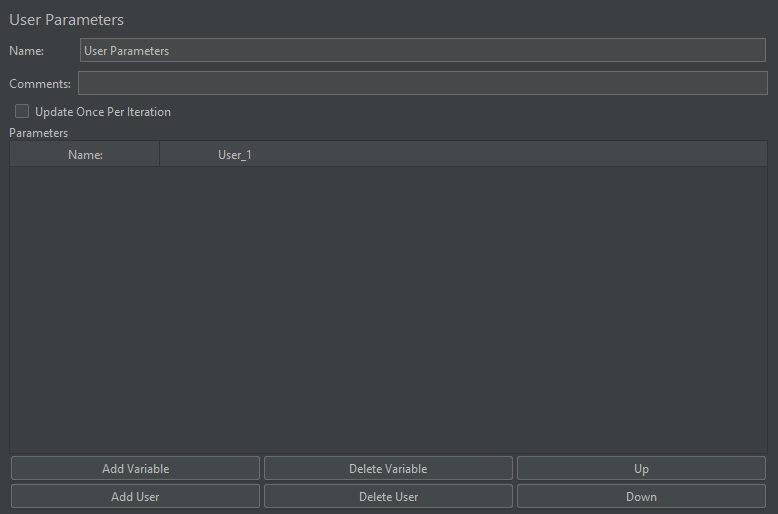
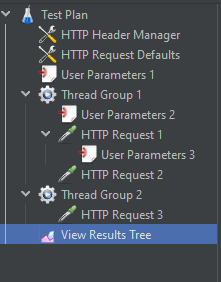
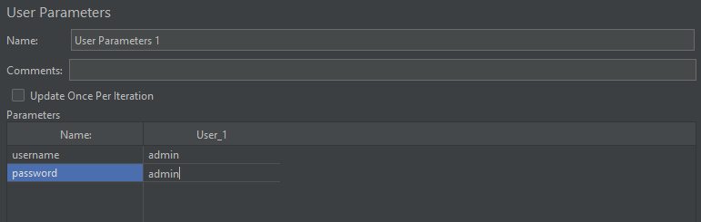
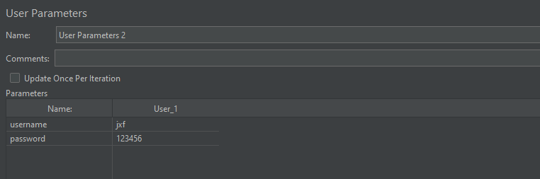
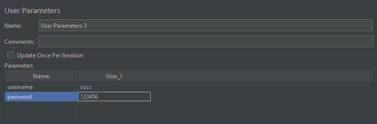
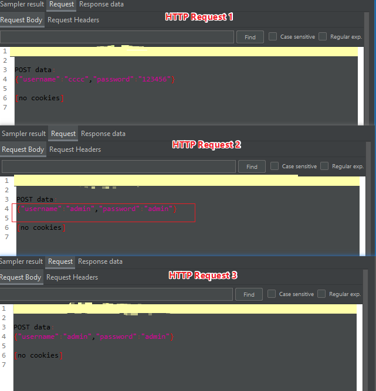
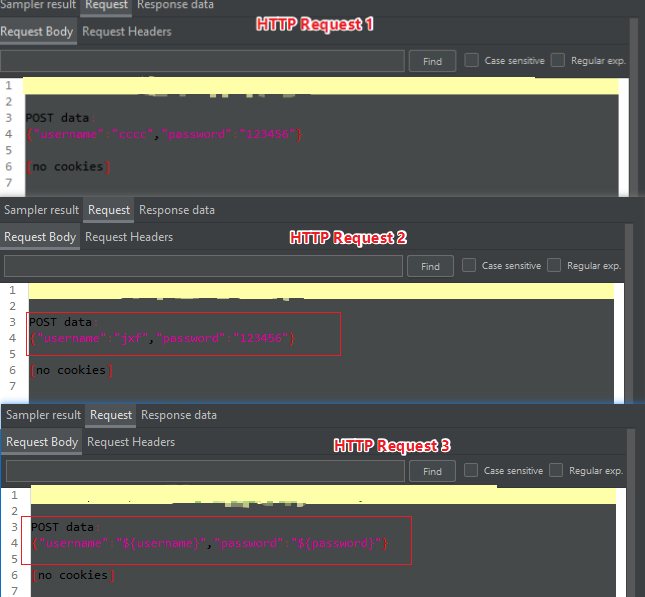
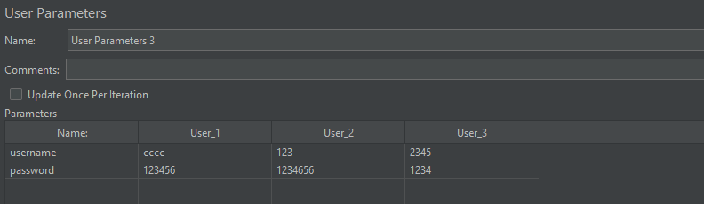
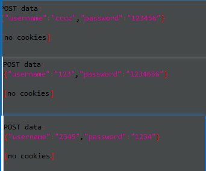
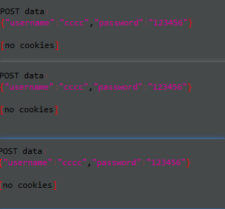

# 用户参数

作用：可动态引入参数

适用范围： 适用于参数取值范围很小的时候使用

位置：前置处理器中

## 界面介绍

测试计划、线程组、 HTTP 请求中均可右键在前置处理器中添加用户参数

| 参数            | 说明       |
| --------------- | ---------- |
| Add Variable    | 添加变量   |
| Delete Variable | 可删除变量 |
| Add User        | 添加用户   |
| Delete User     | 删除用户   |

## 用户参数实例

测试计划、线程组、HTTP 请求中添加用户参数

**第一个用户参数中的配置（测试计划中的用户参数）**：

**第二个用户参数中的配置（线程组1 中的用户参数）**：

**第三个用户参数中的配置（ HTTP Request 1 中的用户参数）**：

结果查看：

看到上述结果发现 HTTP Rquest 2 居然使用了测试计划中的用户参数，线程组中的参数没有生效

禁用测试计划中的用户参数后，重新运行，结果如下：

对比两次引用同一变量结果，发现线程组中的用户参数**居然没有生效**

**思考**：上面的用户参数只有一个值，如果有多个值，如何选择不同的值？

将 HTTP Request 3 中增加变量值：

在线程组1 中将线程数修改为 3，其他设置不变，结果如下：

前面学习 CSV 时，如果要获取全部变量也可以通过设置线程组的循环次数，是否在用户参数中同样适用？

将线程组1 中的线程数设置为 1 ，循环次数设置为 3，运行结果如下：

对比两次结果，发现用户参数只能通过设置线程组的线程数与参数数量一致时才能获取所有的参数值

**总结**：

+ 测试计划中的用户参数作用于所有线程组
+ 测试计划与线程组同时存在同名的用户参数时，线程组中的**不会生效**
+ HTTP 请求中的用户参数优先级**最高**
+ 只能设置线程组中的线程数才能获取所有变量
+ 通过用户参数获取的参数是动态的

（完）