# While 控制器

和 Python 中的 while 循环一样，将一直运行其所有子项，直到条件为 false 为止

## 界面介绍

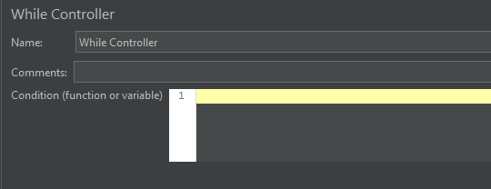

**Condition 可填的值**：

+ BLANK (不输入任何值) ：循环中的最后一个样本失败时退出循环
+ LAST：当循环中的最后一个样本失败时退出循环，如果循环之前的最后一个样本失败，不会进入循环
+ 其他：当条件等于字符串 false 时退出（或不进入）循环

**其他可填的值**：

+  `${VAR}` ：变量VAR在其它项中被赋值为 **false**
+  `${__javaScript(${C}<10)}` ：针对**数字型变量**进行对比判断
+  `${__javaScript("${C}"=="abc")}` ：针对**字符串类型变量**进行对比判断，区别在于双引号
+  `${_P(property)}` ：属性被赋予 **false**

## While 控制器例子

### BLANK

+ 此时其子节点下最后一个节点运行失败，才会停止
+ 否则会一直循环下去（哪怕只有一个失败也不行，需要全部都失败了才退出）

测试结构树 + While Controller：

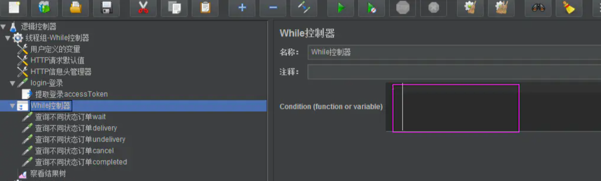

测试结果：

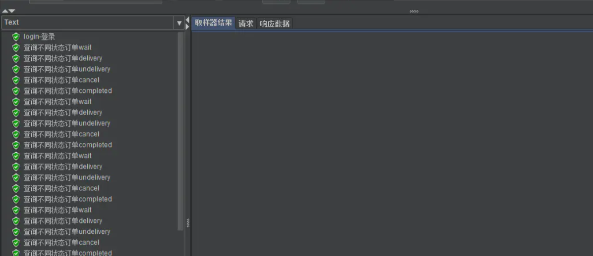

看到会一直在循环

**设置某个请求地址不存在，再次执行，发现失败后，还是会一直在循环执行**

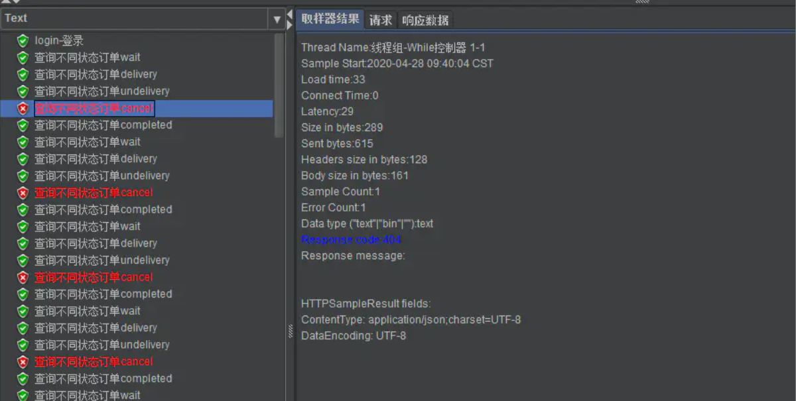

**设置所有的请求地址，无法请求，所有请求失败后，退出循环执行**

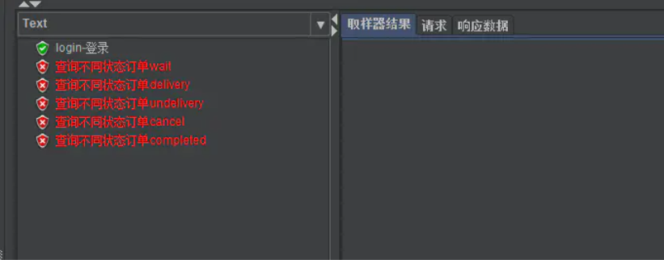

### LAST

+ 当参数设置为 LAST 时，如果 While Controller 的上一个节点运行失败，则不再执行while controller

+ 否则继续执行，与参数为空的情况一致

测试结构树 + While Controller：

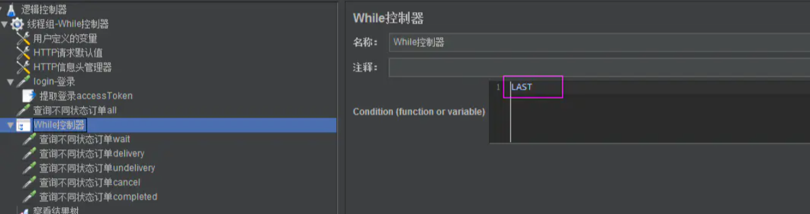

测试结果：

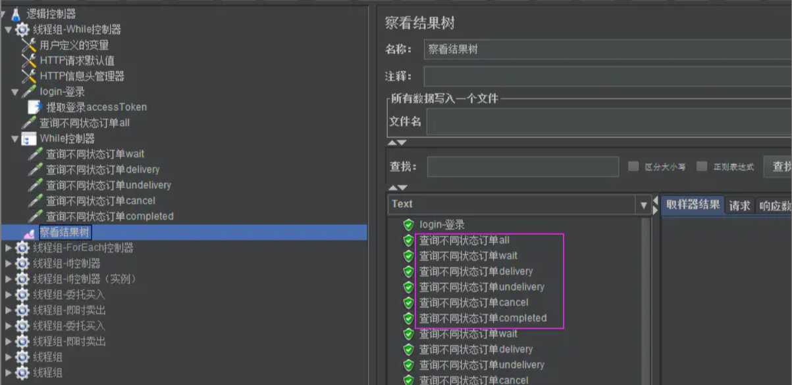

可以看到循环执行

**修改上一个节点【查询不同状态订单all】请求失败，再执行，While 控制器里面的不会再请求**

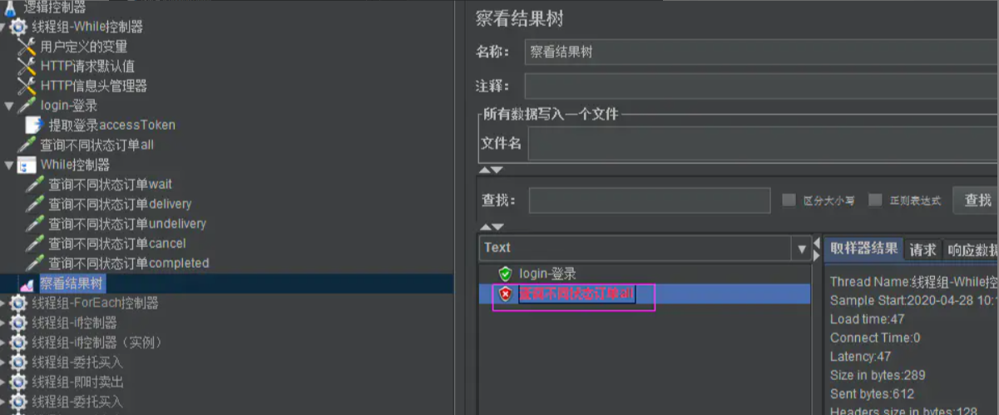

退出循环了

**修改上一个节点【查询不同状态订单all】请求成功，执行，与参数为空的情况一致**

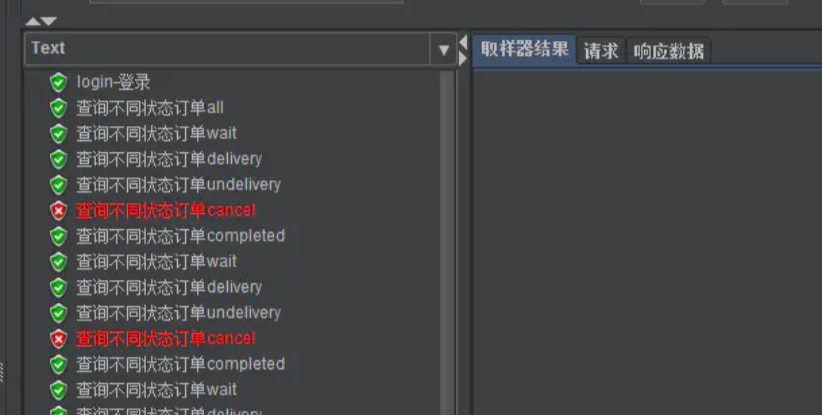

### 表达式

+ 可以使用函数助手生成表达式
+ 表达式的结果为 true，则执行 While Controller
+ 参数中也可以直接输入 true 或 false 来控制是否执行 While Controller

测试计划结构树 + Counter + While Controller：

Counter 设置的范围：0-10

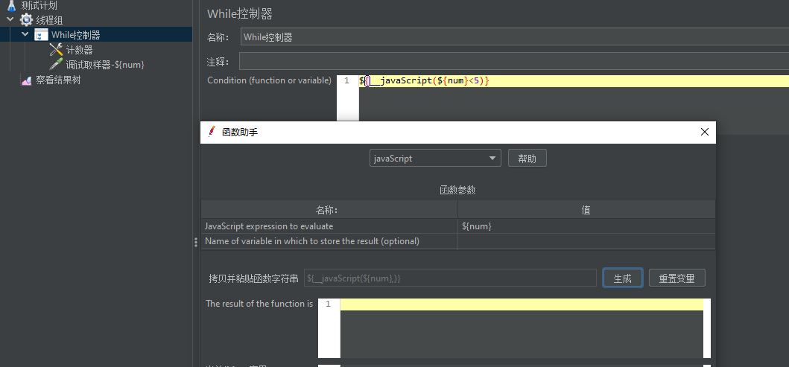

测试结果：

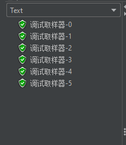

满足了表达式后，执行了 5 次，退出循环

（完）