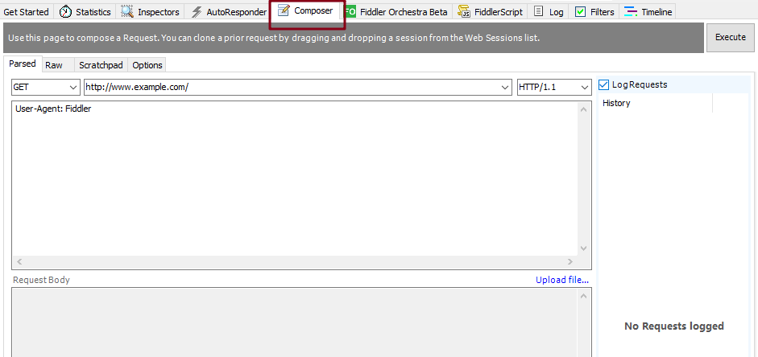
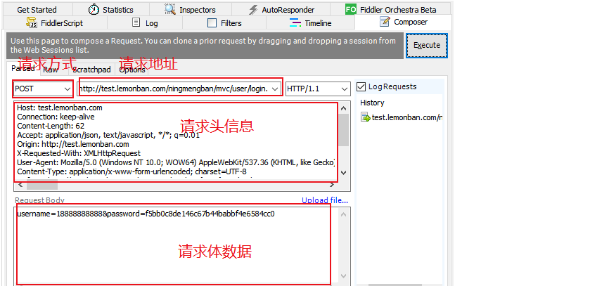
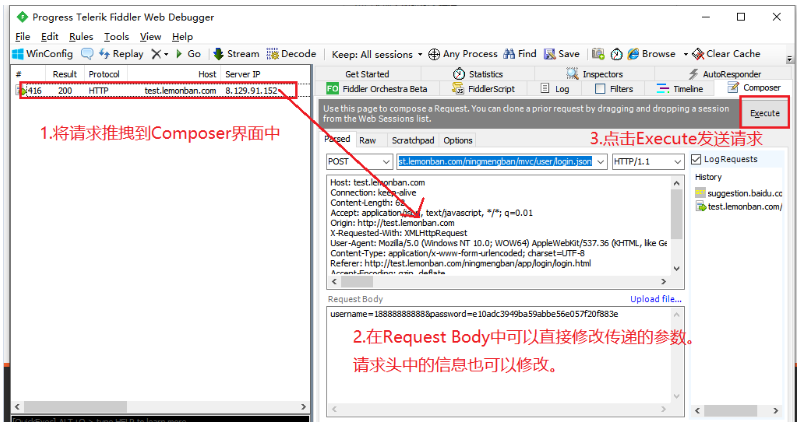

# Composer

## Composer 功能介绍

+ 创建 HTTP request 请求然后发送
+ 允许自定义请求发送到服务器
+ 简单的接口测试工具，发包工具
+ 可以对请求进行重放

**fiddler 创建 request 的方式**:

+ 手写一个 request
+ 在 Web Sessions 会话列表中拖拽一个已有的 request 到 Composer 中

## Composer 界面说明

界面展示：

字段说明：

+ Parsed：
  + 表示已经被解析的整个 HTTP 请求
  + 包括请求行，请求头和请求体（就是最直观的看到 Request 请求的展示）

+ Raw：这个就是真实原始的 HTTP 请求，是没有解析过的展示

+ Scratchpad：可以存储已经收集好的 HTTP 请求，可存储多个不同的请求

+ Optinos：Request Optinos 请求选项

+ Inspect Session：检查会话，当开启此功能并重放的时候，会自动跳入 Inspectors 功能模块，进行检查 HTTP 请求和响应

+ Fix Content-Length header：
  + 默认勾选
  + 当使用 POST 请求进行重放的时候，如果没有 Content-Length 的请求头，fiddler 会自动加上此请求头，如果有但是请求正文大小错误，则它会自动修正

+ Follow Redirects：会自动重定向 301，302 的请求

+ Automatically Authenticate：自动进行身份认证，包括认证 NTLM，http 401，http 407
+ UI Options：
  + Tear off：
    + 此功能是在原有的 fiddler 功能选项里面，将 Composer 这个功能弹出一个浮动窗口
    + 如果不需要直接关闭这个窗口就会恢复原样

+ Log Requests：记录保存重放的 HTTP 请求

+ Request Body：这里设置请求体的内容，一般用在 POST 请求

+ Upload file：此功能是自己在本地构造好一个 HTTP 请求，然后上传到 fiddler 中进行重放

+ Execute：执行重放功能或者执行新编辑请求的按钮

## Composer 使用

### 自定义请求

手动填写 HTTP Request 请求的几个元素，点击 Execute 即可发送该请求：

- 请求的URL

- 请求方式

- 请求头信息

- 请求参数

  

### 重复发送请求

**作用**：可以模拟重复发很多请求的功能，在测试一些接口返回请求频繁的功能时会用到

**步骤**：

+ 先用 fiddler 抓取到需要重复执行的请求

+ 选中该请求，把它拖拽的 Composer 面板中

+ 点击 Execute 按钮，重复执行该请求

### 篡改请求数据

**作用**：可以用来模拟一些请求参数的异常值测试

**步骤**：

+ 首先需要抓取到一个请求，另外将界面切到 Composer 界面
+ 把该请求拖拽到 Composer 界面中
+ 直接在 Composer 中的 Request Body 或者是请求头信息中修改数据
+ 点击 Execute 按钮执行发送请求

执行完毕，可以和正常的浏览器请求一样在 Inspectors 中查看一些信息