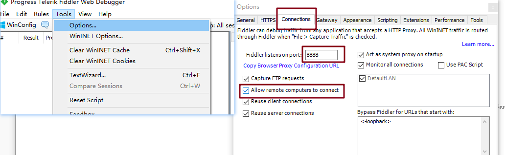
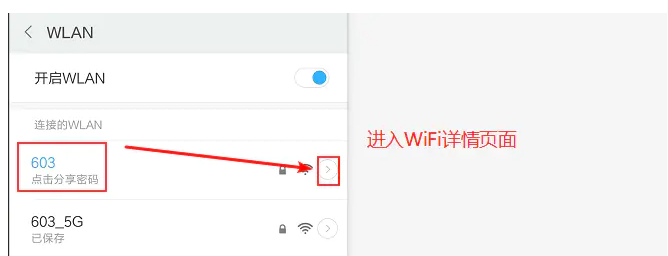
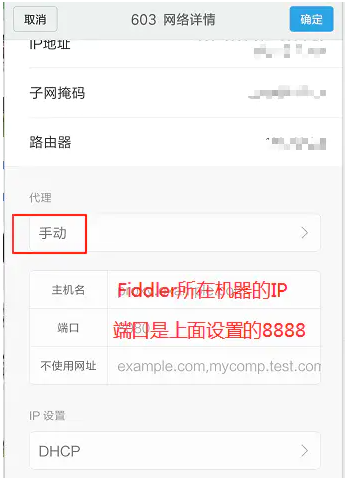
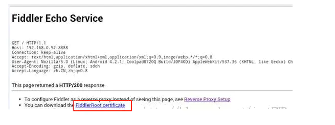

# 抓取手机端数据包设置

fiddler 除了抓取 PC 端的数据包外，也可以抓取手机端的数据包

## 设置

### fiddler 设置

+ 打开 tools-->Options，并选择 Connections 选项卡

  

+ 勾选上图中的 "Allow remote computers connect"，并填入端口号，上面填写的是 8888 可以根据自己实际填写，然后点击确定
+ 需要重启 fiddler

### 手机端设置

+ 进入 WLAN 页，并进入详情页

  

+ 代理方式选择 “手动”，另外主机名是 fiddler 所在机器的 IP，端口是上面设置的 8888 端口

  

  设置完成后，点击确定

+ 安装 fiddler 证书
  + 在手机浏览器网址中输入 fiddler 所在机器的 IP+ fiddler 监听的端口，如：192.168.0.4:8888
  + 点击页面中的 “fiddlerRootcertificate” 链接，在弹出的对话框中随便设置一个名称确定即可

+ 完成后，即可在 fiddler 上抓取手机端的数据包啦

（完）