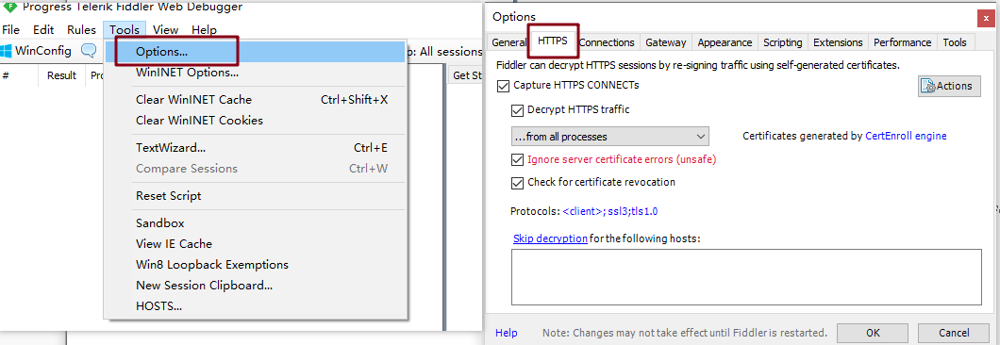
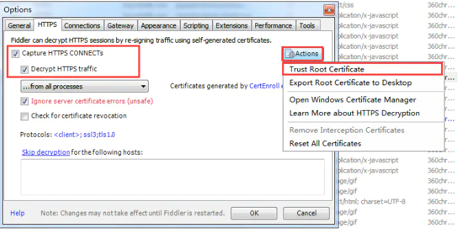
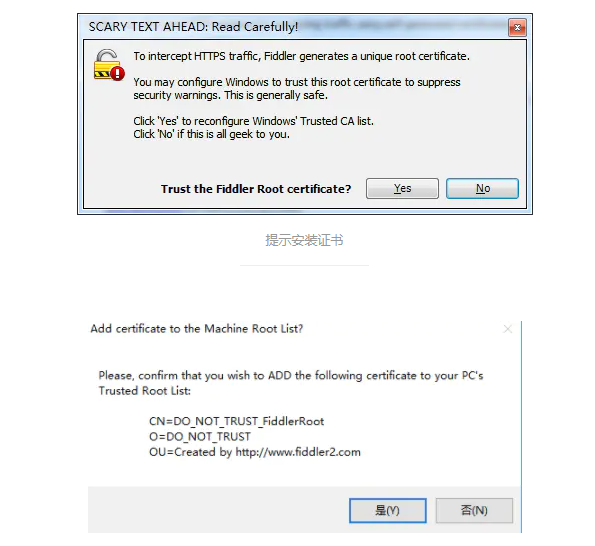
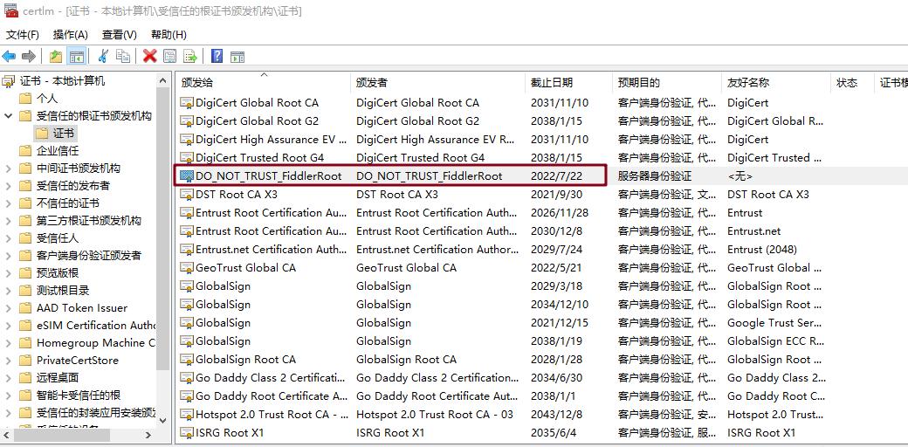
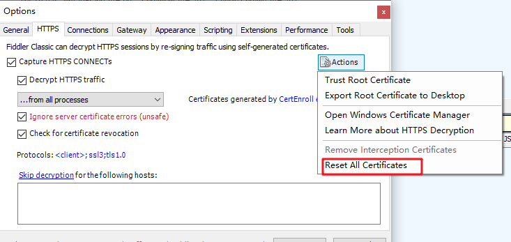

# 抓取 HTTPS 设置

## 前言

+ fiddler 默认是只抓取 HTTP 的数据包
+ 如果想抓取 HTTPS 的数据包，需要进行一些配置

## 设置 HTTPS

+ toos --> Options 打开选项，并选择 HTTPS 选项卡

  

+ 勾选 Capture Https CONNECTs -> Decrypt HTTPS traffic，然后在 Actions 中点击 Trust Root Certificate

  

  

+ 安装证书成功后会在证书中查看到

  

根据上面的步骤完成后，需要重启 fiddler 即可抓取到 HTTPS 的数据包了

**注意**：如果之前安装过 fiddler，需要重置之前的证书，再重新安装证书

（完）